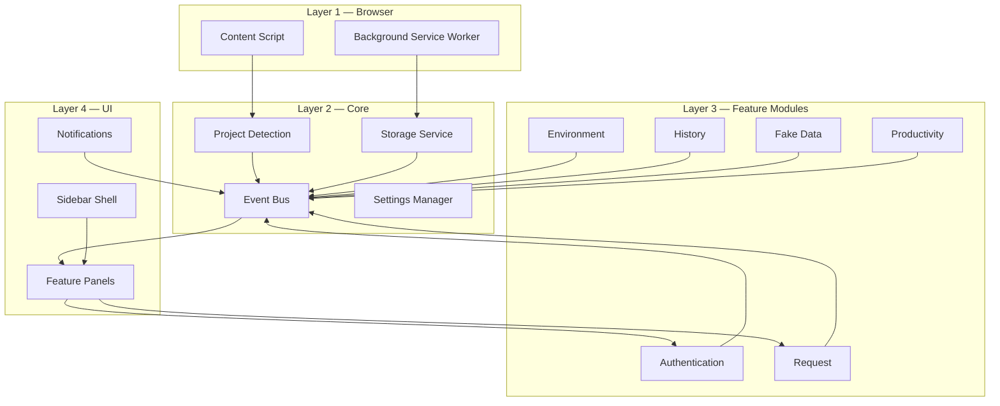
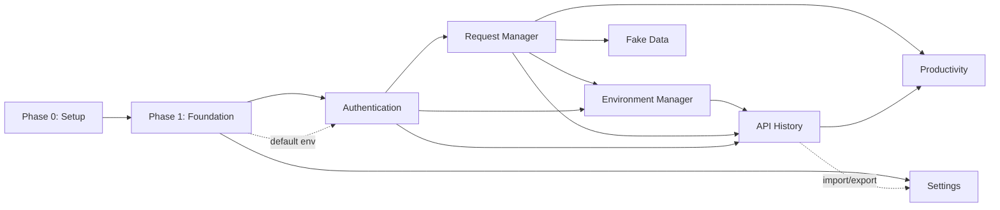

# 01 — Project Analysis

> **Status:** Engineering blueprint for OpenAPI Companion v1.0
> **Source of truth:** `docs/` (PRD, FDDs, Architecture, Storage, Security, Edge Cases, Design Decisions, Roadmap)
> **Audience:** Engineering, Product, QA, and any new contributor joining the project.

This document is the analytical foundation for the entire `planning/` suite. It summarizes the product, the architecture, the modules, their dependencies, and the risks/unknowns derived from a complete read of the documentation. Where the documentation is silent on something an implementation team will need, it is flagged in **Questions for Product Owner** rather than invented.

---

## 1. Product Summary

OpenAPI Companion is a **Manifest V3 browser extension** that adds a persistent, productivity-focused workspace **on top of** existing OpenAPI documentation tools (Swagger UI first; ReDoc/Scalar/RapiDoc later). It does not replace those tools and requires **zero backend changes**.

The product solves one root problem: OpenAPI documentation UIs were built for *exploration*, not as *persistent developer workspaces*, so they discard developer context (authorization, request bodies, parameters, environment) on every page refresh. OpenAPI Companion remembers that context.

| Attribute | Value |
|---|---|
| Product type | Browser extension (Chromium: Chrome, Edge, Brave, Arc, Opera) |
| Manifest | V3 |
| Frontend | React + TypeScript (strict) |
| Build | Vite |
| Styling | Tailwind CSS |
| State | Zustand |
| Storage | `chrome.storage.local` (primary), `chrome.storage.sync` (future, settings only) |
| Testing | Vitest (unit/integration), Playwright (E2E/browser) |
| Network posture | Local-first, zero telemetry, no external servers in normal operation |
| Initial doc target | Swagger UI |

**v1.0 (MVP) modules — 7:** Authentication Manager, Request Manager, Environment Manager, API History, Fake Data Generator, Productivity Tools, Settings.

**Deferred to v1.1+ (NOT in v1.0):** Collections (v1.1), Workflow Runner (v1.2), Response Inspector (v1.3). These are designed (FDDs exist) but explicitly out of MVP scope per `16_MVP_SCOPE.md` and `19_DESIGN_DECISIONS.md` (DD-019, DD-020).

### Core principles (constraints on every decision)
1. **Zero backend changes** — no middleware, plugins, or framework coupling (DD-004, DD-014).
2. **Local-first** — all data on device; no mandatory account; no telemetry (DD-005, DD-021, DD-022).
3. **Framework-independent** — works with any OpenAPI-compliant implementation.
4. **Enhance, never replace** — Swagger remains the primary workspace; sidebar-first UI (DD-012, DD-024).
5. **Productivity before complexity** — every feature must remove repetitive work.

---

## 2. Architecture Summary

A modular, layered, event-driven architecture. Four layers, strict downward dependencies, modules communicate **only** through an event bus.

**Hard architectural rules (from `11_TECHNICAL_ARCHITECTURE.md`):**
- Allowed dependency chain: `UI → Service → Storage`. **Forbidden:** `UI → Storage` directly.
- Modules never call each other directly — only via the event bus (loose coupling).
- Business logic lives in services; UI is presentational; storage access is centralized in `StorageService`.
- Every module has the same internal shape: `index.ts`, `service.ts`, `store.ts`, `types.ts`, `constants.ts`, `hooks.ts`, `utils.ts`, `components/`.
- Adding a new module must require only: new module folder + registration + event subscriptions + UI entry. No existing module changes.

See `07_ARCHITECTURE_PLAN.md` for the full treatment.

---

## 3. Major Modules

| # | Module | MVP? | Core responsibility | Primary service |
|---|---|---|---|---|
| Core | Storage | ✅ | Namespaced, versioned, migratable persistence | `StorageService` |
| Core | Event Bus | ✅ | Inter-module pub/sub | `EventBus` |
| Core | Project Detection | ✅ | Identify project from page; stable project ID | `ProjectService` |
| Core | Swagger Adapter | ✅ | Read/write Swagger DOM auth & request fields | `SwaggerAdapter` |
| 1 | Authentication Manager | ✅ | Persist & auto-restore auth per project+environment | `AuthenticationService` |
| 2 | Request Manager | ✅ | Auto-save/restore request data; templates | `RequestService` |
| 3 | Environment Manager | ✅ | Multi-environment CRUD + switching + variables | `EnvironmentService` |
| 4 | API History | ✅ | Auto-record executed requests/responses; replay | `HistoryService` |
| 5 | Fake Data Generator | ✅ | Generate realistic field values offline | `FakeDataService` |
| 6 | Productivity Tools | ✅ | Search, favorites, recents, copy-as-code, sidebar | `ProductivityService` |
| 7 | Settings | ✅ | Theme, storage mgmt, import/export, reset | `SettingsService` + `ImportExportService` |
| 8 | Collections | v1.1 | Curated request groups | `CollectionService` |
| 9 | Workflow Runner | v1.2 | Sequential request execution | `WorkflowService` |
| 10 | Response Inspector | v1.3 | Enhanced response viewing/comparison | `ResponseInspectorService` |

---

## 4. Feature Dependencies

The critical insight resolving the apparent **circular dependency** between Authentication, Request, and Environment:

> Authentication is *per environment* and Requests are *per environment*, while Environment Manager depends on both to demonstrate switching. **Resolution:** Foundation establishes a guaranteed **default environment** for every detected project. Authentication and Request Manager are built scoped to the *active* environment (initially the default). Environment Manager later adds multi-environment CRUD and the switch behavior that re-loads auth + requests.

| Module | Hard dependencies (must exist first) | Soft / integration dependencies |
|---|---|---|
| Authentication | Storage, Project Detection, Event Bus, Swagger Adapter, default environment | Environment Manager (env-scoped isolation) |
| Request Manager | Storage, Project Detection, Event Bus, Swagger Adapter, Authentication | Environment Manager (env-scoped restore) |
| Environment Manager | Storage, Project Detection, Event Bus, Authentication, Request Manager | — |
| API History | Storage, Request Manager, Authentication, Environment Manager, Event Bus | Response Inspector (v1.3) |
| Fake Data Generator | Request Manager, Storage, Event Bus, Swagger Adapter | — |
| Productivity Tools | Request Manager, API History, Storage, Sidebar, Event Bus | — |
| Settings | Storage, Event Bus, Theme Manager, Import/Export | Touches all modules for import/export & reset |

Full graph with parallelizable workstreams: see `06_DEPENDENCY_GRAPH.md`.

---

## 5. Technical Risks (summary)

Full register with probability/impact/mitigation in `17_RISK_ANALYSIS.md`. Highest-priority risks:

| ID | Risk | Why it matters |
|---|---|---|
| R-01 | **Swagger UI DOM coupling** — reading/writing auth & request fields depends on Swagger's internal DOM, which can change between Swagger versions (EC-008…EC-014, "Swagger DOM changes"). | Core value (auth/request persistence) breaks silently on a Swagger update. |
| R-02 | **Large local data** — big histories/payloads (quota ceiling removed by `unlimitedStorage`/DD-035; residual risk is performance/memory, EC-023, EC-039). | Slow search/render at scale (not data loss). |
| R-03 | **MV3 service worker lifecycle** — workers are killed aggressively; no long-lived in-memory state. | Lost listeners, missed events, race conditions on restore. |
| R-04 | **Multi-tab / multi-window storage races** (EC-002, EC-003). | Corrupted or last-write-wins data loss. |
| R-05 | **Token security** — tokens stored in plaintext in `chrome.storage.local`. | Sensitive credentials exposure; needs explicit handling & user warnings. |
| R-06 | **Migration safety** across schema versions (EC-033, EC-034, EC-042). | A bad migration corrupts all user data. |

---

## 6. Unknowns

These require investigation/spikes during Phase 0–1 (tracked as spike tasks in `05_TASK_BREAKDOWN.md`).

1. **Swagger UI auth injection mechanism** — Exactly how to programmatically set Swagger's authorization state across Swagger UI 3.x/4.x/5.x versions, and whether a stable hook exists vs. DOM manipulation only.
2. **Request field detection** — How reliably request body/params/headers can be read and re-populated in Swagger's "Try it out" forms across versions.
3. **`chrome.storage.local` behavior with `unlimitedStorage`** — Resolved that we request `unlimitedStorage` (DD-035); remaining unknown is real-world eviction/perf behavior at large sizes across Chrome/Edge/Brave/Arc/Opera (drives the DD-031 performance cap default).
4. **Variable substitution scope** — Whether `{{VAR}}` substitution applies only to Companion-managed values or must rewrite Swagger's outgoing request (latter is far harder and may violate "never modify backend requests unexpectedly").
5. **Response capture mechanism** — How API History captures responses: intercept `fetch`/XHR in page context, observe Swagger's response DOM, or both. Affects content-script architecture and security posture.
6. **Project identity stability** — The exact hashing of `Origin + OpenAPI URL + doc type` and behavior when the OpenAPI URL changes (EC-007).

---

## 7. Missing Information

Documentation gaps that do not block starting Phase 0 but must be answered before the dependent feature is built. Most are now **resolved** via DD-031…DD-038 (see §9 and `00_PROPOSED_PO_ANSWERS.md`).

| Area | Gap | Status |
|---|---|---|
| Testing | `15_TESTING_STRATEGY.md` is truncated — no explicit coverage thresholds, no concrete test matrix. | **Resolved** — DD-034; matrix in `13_TEST_PLAN.md` |
| Storage limits | No numeric cap for history entries / max payload size to retain. | **Resolved** — DD-031 (`MAX_HISTORY_ITEMS`=1000 *performance* cap) + DD-035 (`unlimitedStorage`) + DD-039 (Downloads backup) |
| Performance | NFRs give per-operation targets (e.g., restore < 100 ms) but no device/CPU baseline or measurement method. | **Open** — define a CI benchmark baseline machine (`13` §6) |
| Keyboard shortcuts | Canonical map + collision policy were unspecified. | **Resolved** — DD-038 |
| Accessibility | No WCAG conformance level named. | **Resolved** — DD-036 (WCAG 2.1 AA) |
| Branding/assets | No logo, icon set, color hex values, or Chrome Web Store listing copy provided. | **Open** — needed for Phase 10 listing (asset task T-11.2) |
| Licensing | No specific license chosen. | **Resolved** — DD-036 (MIT) |

---

## 8. Suggested Improvements

Non-binding engineering recommendations that respect the documented vision:

1. **Adopt a thin `SwaggerAdapter` abstraction** behind a versioned interface so DOM-coupling risk (R-01) is isolated to one replaceable module — this also pre-builds the seam for ReDoc/Scalar/RapiDoc adapters (Phase 6 of roadmap).
2. **Cap + ring-buffer the History store** with a configurable `MAX_HISTORY_ITEMS` (default 1000/project as a *performance* control under `unlimitedStorage`) and store large response bodies in a separate `cache/` namespace that can be evicted independently (DD-031/DD-035).
3. **Schema-versioned envelopes** on every stored object (`{ schemaVersion, createdVersion, updatedVersion, data }`) from day one, with a registered migration pipeline (mitigates R-06).
4. **Centralize all writes through a debounced, batched `StorageService`** with a single-writer lock keyed by project to mitigate multi-tab races (R-04).
5. **Token handling:** mask by default in UI, never log (enforced via lint rule), and ship an explicit "exported file contains secrets" warning. Consider Web Crypto encryption-at-rest as a fast-follow (documented as optional in security doc).
6. **Choose `MIT` license** and add `SECURITY.md`, `CODE_OF_CONDUCT.md`, issue/PR templates early to support the open-source assumption.
7. **WCAG 2.1 AA** as the accessibility target (consistent with "first-class keyboard navigation" DD-026).

---

## 9. Questions for Product Owner — RESOLVED

> Per the planning rules, these were **not invented** — they were open decisions required to finalize the plan. **All 8 are now resolved** via accepted proposals recorded in `00_PROPOSED_PO_ANSWERS.md` and added to the design-decision log as **DD-031…DD-038** (`docs/19_DESIGN_DECISIONS.md`); the storage answers (Q1+Q5) also produced **DD-039** (Downloads-folder backup). Two (DD-033 capture mechanism, DD-037 token storage) additionally carry a **security-reviewer sign-off** requirement.

| # | Decision | Resolution | DD |
|---|---|---|---|
| 1 | History limits & eviction | `MAX_HISTORY_ITEMS` = **1000/project** (configurable 100–10000 or "No limit"); **performance** cap (not quota) since `unlimitedStorage` is granted; silent ring-buffer; large bodies offloaded to evictable `cache/` | DD-031 |
| 2 | Variable substitution scope | **Companion-scoped, populate-time** only; never rewrite the outgoing request | DD-032 |
| 3 | Response capture | **DOM observation** of Swagger's rendered response for v1.0; network observer deferred/opt-in *(security sign-off)* | DD-033 |
| 4 | Coverage targets | ≥80% services/utils, ≥70% stores/hooks, ≥60% components, 100% EC mapped, E2E-01…15 mandatory | DD-034 |
| 5 | `unlimitedStorage` | **Yes** — request it so local capacity is disk-limited (data still local in `chrome.storage.local`); permission set → 5 (`+unlimitedStorage,+downloads`) | DD-035 |
| 6 | License & accessibility | **MIT** + **WCAG 2.1 AA** | DD-036 |
| 7 | Token storage | **Plaintext + strict handling** for v1.0; optional passphrase encryption in v1.1 *(security sign-off)* | DD-037 |
| 8 | Shortcut map & collisions | Shift-chord map (Search `Ctrl/⌘+K`); all remappable with collision detection | DD-038 |
| — | Downloads-folder backup (from Q1+Q5) | JSON backup to Downloads via `chrome.downloads` — manual + optional auto-snapshot (Simple-Tab-Groups pattern); portable backup, not the live store | DD-039 |

---

## 10. Document Index

This analysis feeds the rest of the suite:

| Doc | Purpose |
|---|---|
| `02_PHASE_PLAN.md` | 11 phases with goals, deliverables, exit criteria, risks |
| `03_SPRINT_PLAN.md` | 16 two-week sprints with DoD & acceptance criteria |
| `04_EPICS.md` | 12 epics → stories → technical/test/docs tasks |
| `05_TASK_BREAKDOWN.md` | Story-point-sized engineering tasks per feature |
| `06_DEPENDENCY_GRAPH.md` | Build order, blockers, parallelizable streams |
| `07_ARCHITECTURE_PLAN.md` | Module/data/event/auth/lifecycle diagrams |
| `08_STORAGE_PLAN.md` | `chrome.storage.local` schema, indexes, migration |
| `09_UI_PLAN.md` | Screens with purpose/components/states/a11y |
| `10_COMPONENT_PLAN.md` | Full component tree |
| `11_SERVICE_PLAN.md` | Service interfaces (methods/inputs/outputs/errors) |
| `12_EVENT_SYSTEM.md` | Event bus catalog |
| `13_TEST_PLAN.md` | Test layers, matrix, tooling |
| `14_GIT_STRATEGY.md` | Branching, commits, PR, review |
| `15_CI_CD.md` | GitHub Actions pipeline |
| `16_CODING_STANDARD.md` | Conventions |
| `17_RISK_ANALYSIS.md` | Risk register |
| `18_TECH_DEBT.md` | Debt prevention strategy |
| `19_RELEASE_PLAN.md` | Release process to v1.0 |
| `20_MILESTONES.md` | Milestone roadmap |
