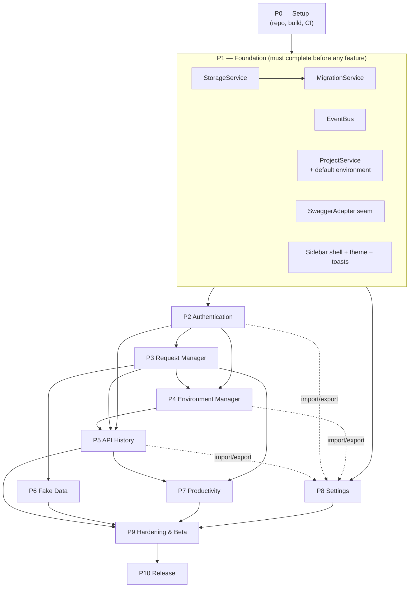
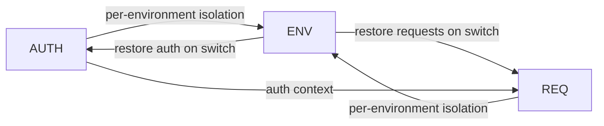

# 06 — Dependency Graph & Build Order

> Answers: *Which module is built first? Which blocks others? What can run in parallel? What requires completed dependencies?* Cross-references `01_PROJECT_ANALYSIS.md` §4 and `02_PHASE_PLAN.md`.

## 1. Build Order (linear critical path)

**Canonical build order:**
`Setup → Foundation (Storage → Migration; EventBus; ProjectService+default env; SwaggerAdapter; Sidebar shell) → Authentication → Request Manager → Environment Manager → API History → Fake Data Generator → Productivity Tools → Settings → Hardening/Beta → Release`

This matches the README's example ordering (Auth → Request → Environment → History) and the feature-design recommended order.

## 2. The circular dependency, resolved

Three modules form a soft cycle in the FDDs:

**Resolution:** Foundation guarantees a **`default` environment** for every project. Auth and Request are implemented against the *active environment* (initially `default`), with no dependency on the Environment Manager UI/CRUD. Environment Manager is built afterward and *adds* the switch behavior that re-loads auth + requests. The cycle becomes a clean DAG. This is the single most important sequencing decision in the plan.

## 3. Blocking matrix

| Module | Blocks (cannot start until this is done) | Blocked by |
|---|---|---|
| StorageService | Everything | P0 setup |
| MigrationService | Any stored-schema work, Settings import/export | StorageService |
| EventBus | All inter-module integration | P0 setup |
| ProjectService (+default env) | Auth, Request, Environment, History, Productivity | Storage, EventBus, SwaggerAdapter |
| SwaggerAdapter | Auth (write), Request (read/write), History (response capture) | P0 setup (spike) |
| Sidebar shell | All feature panels | EventBus, theme |
| Authentication | Request, Environment, History | Foundation |
| Request Manager | Environment, History, Fake Data, Productivity | Authentication |
| Environment Manager | History (env-scoped) | Auth + Request |
| API History | Productivity (recents), Response Inspector (v1.3) | Auth + Request + Environment |
| Fake Data | — | Request |
| Productivity | — | Request + History |
| Settings | — (but integrates with all for import/export) | Foundation |

## 4. Parallelizable workstreams

Once **Foundation** is complete, the team can fan out. Recommended parallel tracks (assuming ~2–3 sub-teams / pairs):

```mermaid
gantt
    title Parallelization after Foundation
    dateFormat  X
    axisFormat %s
    section Track A (core feature spine)
    Authentication      :a1, 0, 2
    Request Manager     :a2, after a1, 2
    Environment Manager :a3, after a2, 1
    API History         :a4, after a3, 2
    section Track B (independent add-ons)
    Settings (shell + theme + storage mgmt) :b1, 0, 2
    Fake Data Generator (needs Request)     :b2, 4, 1
    Productivity (needs Request + History)  :b3, 7, 1
    section Track C (cross-cutting)
    Test harness + E2E scaffolding :c1, 0, 8
    Design system / shared components :c2, 0, 4
```

**Safe to build in parallel:**
- **Settings shell, theme, and storage-management UI** can start immediately after Foundation (they depend only on Storage/Events) — only *import/export of feature data* must wait for the feature schemas to stabilize.
- **Design-system / shared UI components** (buttons, inputs, tables, toasts, dialogs, empty states) can be built in parallel with the feature spine from day one (see `10_COMPONENT_PLAN.md`).
- **Test scaffolding and E2E page objects** can be developed alongside features.
- **Fake Data Generator** can be built as soon as Request Manager exposes its field-population API, regardless of Environment/History progress.

**Must be serialized:**
- Authentication → Request → Environment → History (the spine).
- Anything touching `SwaggerAdapter` write paths should land coordinated to avoid DOM-contract churn.

## 5. Critical path & duration

The critical path is the feature spine plus hardening:

`Setup (S1) → Foundation (S2–S3) → Auth (S4–S5) → Request (S6–S7) → Environment (S8) → History (S9–S10) → Hardening/Beta (S14–S15) → Release (S16)`

Fake Data (S11), Productivity (S12), and Settings (S13) sit slightly off the critical path and can be compressed/parallelized if staffing allows, but are scheduled sequentially in the baseline plan to keep `SwaggerAdapter` and storage contracts stable. Total baseline: **16 sprints ≈ 32 weeks ≈ 7.5 months**.

## 6. External / cross-cutting dependencies

| Dependency | Needed by | Notes |
|---|---|---|
| Vite MV3 build config (CRXJS or equivalent) | P0 | De-risk in S1 spike |
| Swagger UI version matrix for adapter | P1–P5 | Test fixtures across Swagger 3.x/4.x/5.x |
| Chrome Web Store developer account | P10 | Provision early (lead time for verification) |
| Logo / icon assets / listing copy | P10 | **Blocked on PO** (see Analysis §7) |
| License text | P0 | **Resolved** — MIT (DD-036) |
| Privacy policy text (Web Store listing) | P10 | Drafted from local-first/zero-telemetry posture (`docs/13`); needs final review |

## 7. v1.1+ dependencies (informational)

| Future module | Depends on (already shipped in v1.0) |
|---|---|
| Collections (v1.1) | Request Manager, Storage, ProjectService |
| Workflow Runner (v1.2) | Request, Auth, Environment, History |
| Response Inspector (v1.3) | API History (response data) |

These confirm the v1.0 architecture leaves clean seams for post-MVP modules without rework (architecture success criterion).
