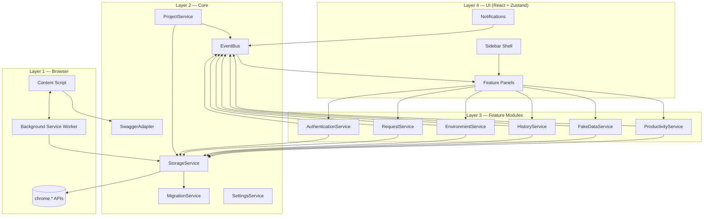
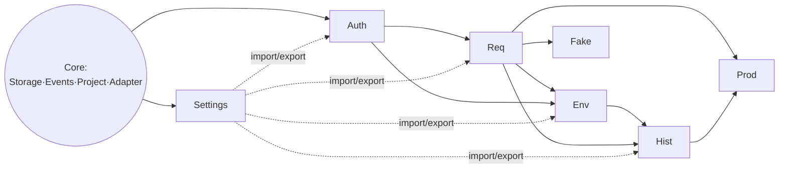
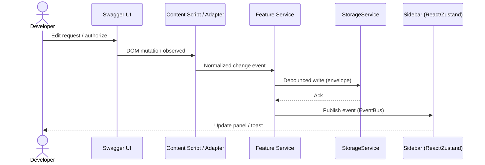
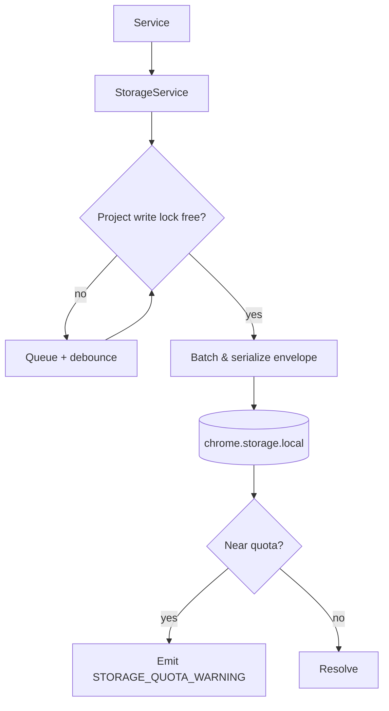
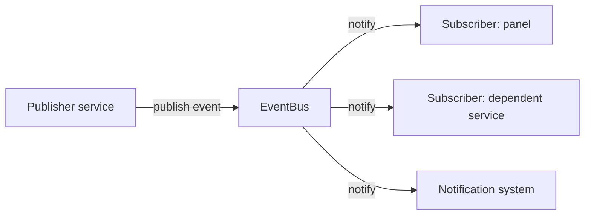
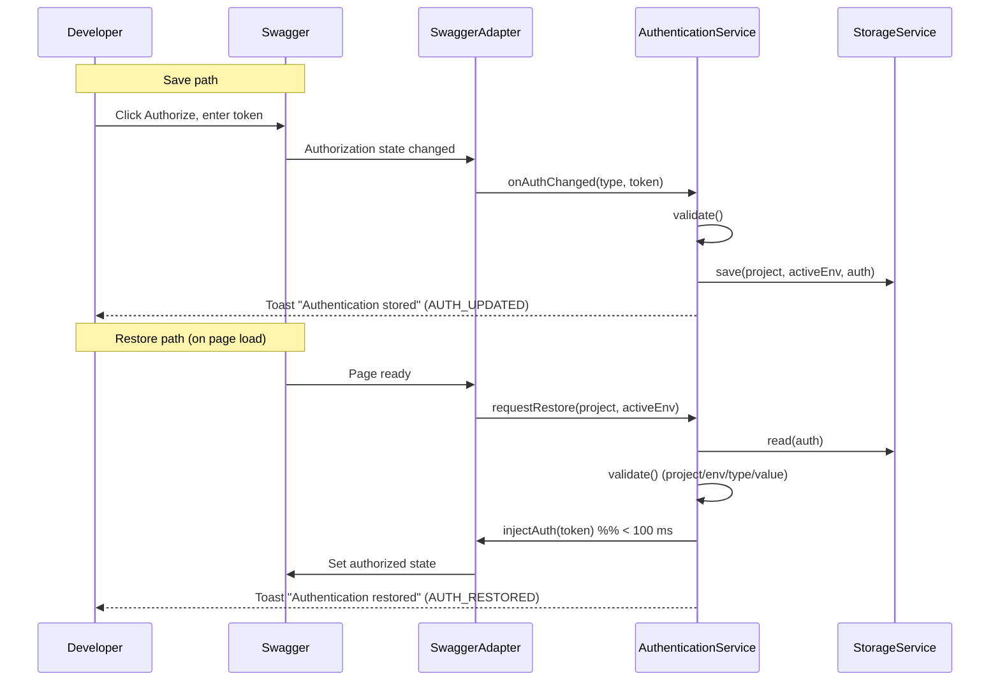
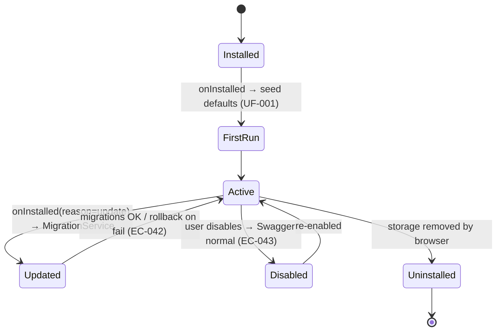
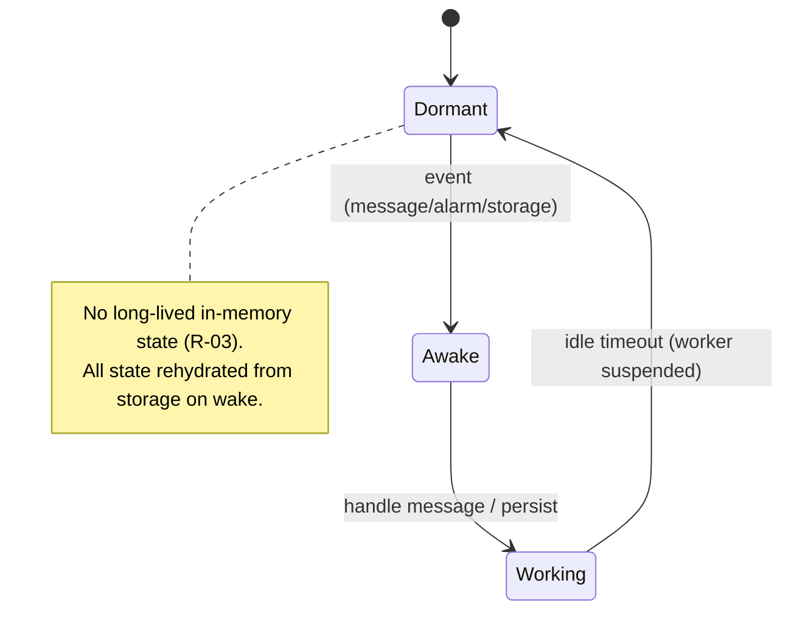

# 07 — Architecture Plan

> Concrete architecture for v1.0, expanding `docs/11_TECHNICAL_ARCHITECTURE.md` into implementation-ready diagrams and the full repository layout. All diagrams are Mermaid. Respects design decisions DD-007 (modular), DD-008 (MV3), DD-009 (Zustand), DD-010 (React+TS), DD-011 (Tailwind), DD-024 (sidebar-first).

## 1. Layered Architecture



**Dependency rules (enforced via ESLint import boundaries):**
- `UI → Service → Storage` allowed; `UI → Storage` **forbidden**.
- Feature modules never import each other; they communicate only through `EventBus`.
- `SwaggerAdapter` is the **only** code allowed to touch Swagger's DOM (isolates R-01).

## 2. Module Dependency Diagram



## 3. Data Flow



Business logic stays in services; the store is a cache of service results; components render store state.

## 4. Storage Flow



## 5. Event Flow


Full catalog (publishers, subscribers, payloads, lifecycle): `12_EVENT_SYSTEM.md`.

## 6. Authentication Flow



## 7. Initialization Flow

```mermaid
flowchart TD
    Load[Swagger page loads] --> Detect{SwaggerAdapter.detect()}
    Detect -- no --> Idle[Stay dormant — do nothing EC-005]
    Detect -- yes --> PID[ProjectService.identify → project ID]
    PID --> Exists{Workspace exists?}
    Exists -- no --> Create[Create workspace + default environment]
    Exists -- yes --> LoadWS[Load workspace + last-active env]
    Create --> Boot
    LoadWS --> Boot[Load settings + module stores]
    Boot --> Inject[Inject sidebar shell]
    Inject --> Restore[Auth + Request restore for active env]
    Restore --> Ready[Ready — no page-perf impact]
```

## 8. Extension Lifecycle



## 9. Browser Lifecycle (MV3 service worker)



## 10. Repository / Folder Plan

Every folder, and why it exists (expands `docs/11` + README folder planning):

```text
openapi-companion/
├── .github/                      # CI workflows, PR/issue templates, CODEOWNERS
├── public/                       # static assets copied verbatim into the bundle
├── docs/                         # product/source-of-truth docs (existing)
├── planning/                     # this engineering blueprint
├── src/
│   ├── manifest.json             # MV3 manifest (perms: storage/activeTab/scripting/unlimitedStorage/downloads — DD-035; entries; CSP)
│   ├── background/               # service worker: lifecycle, messaging, migration trigger
│   │   └── index.ts
│   ├── content/                  # content script: detect Swagger, mount sidebar, bridge
│   │   ├── index.ts
│   │   └── bridge.ts             # content↔background messaging
│   ├── sidebar/                  # React entry for the injected sidebar app
│   │   ├── index.tsx
│   │   └── App.tsx
│   ├── popup/                    # toolbar popup (minimal: status + open sidebar)
│   ├── adapters/                 # SwaggerAdapter + future ReDoc/Scalar/RapiDoc adapters
│   │   ├── types.ts
│   │   └── swagger/
│   ├── core/                     # cross-cutting core services
│   │   ├── storage/              # StorageService + MigrationService
│   │   ├── events/               # EventBus + event type map
│   │   ├── project/              # ProjectService
│   │   └── settings/             # SettingsService, ImportExportService
│   ├── modules/                  # feature modules (one folder each, identical shape)
│   │   ├── authentication/
│   │   │   ├── index.ts          # public module API + registration
│   │   │   ├── service.ts        # business logic
│   │   │   ├── store.ts          # Zustand store
│   │   │   ├── types.ts
│   │   │   ├── constants.ts
│   │   │   ├── hooks.ts          # React hooks bridging store/service
│   │   │   ├── utils.ts
│   │   │   └── components/
│   │   ├── request/
│   │   ├── environment/
│   │   ├── history/
│   │   ├── fake-data/
│   │   └── productivity/
│   ├── components/               # shared design-system components (no business logic)
│   ├── hooks/                    # shared React hooks
│   ├── stores/                   # global Zustand stores (project, env, theme, settings)
│   ├── services/                 # shared service utilities (notification, logger)
│   ├── utils/                    # pure helpers
│   ├── constants/                # global constants (keys, limits, shortcut map)
│   ├── types/                    # shared TS types/interfaces & schemas
│   ├── styles/                   # Tailwind base + tokens
│   └── tests/                    # test utilities, fixtures (Swagger version fixtures), e2e
├── package.json
├── vite.config.ts
├── tailwind.config.ts
├── tsconfig.json
└── README.md
```

| Folder | Why it exists |
|---|---|
| `background/` | MV3 worker: lifecycle hooks, message routing, migration trigger. Stateless (R-03). |
| `content/` | Detect Swagger, inject sidebar, bridge page ↔ extension. No business logic. |
| `sidebar/` `popup/` | React UI entry points. |
| `adapters/` | **Single home for DOM coupling** (R-01); pre-builds multi-tool support seam. |
| `core/` | Shared services every module depends on (storage, events, project, settings). |
| `modules/` | Feature isolation; identical internal shape → predictable, easy to add new modules. |
| `components/` `hooks/` `stores/` `services/` `utils/` `constants/` `types/` `styles/` | Shared, reusable, business-logic-free building blocks. |
| `tests/` | Fixtures (esp. Swagger version fixtures), test utils, Playwright specs. |

## 11. Performance & Scalability Architecture
- **Lazy-load** feature modules and heavy panels (history, large response views).
- **Debounce/batch** all storage writes; **cache** frequently-read project/env in stores.
- **Virtualize** long lists (history, search results, large specs — EC-039/041).
- **Index** endpoints once per project for search (Productivity).
- New modules integrate via folder + registration + events + UI entry only — no edits to existing modules (architecture success criterion).

## 12. Error Handling & Logging
- Every service wraps operations in try/catch with a **recovery strategy** (EC recovery sequence: Detect → Validate → Recover → else Notify + manual recovery).
- Centralized `logger`: verbose in dev, warnings/errors only in prod; **never logs tokens/secrets** (enforced by lint rule + security test).
- Errors never crash the extension; Swagger always remains functional.
