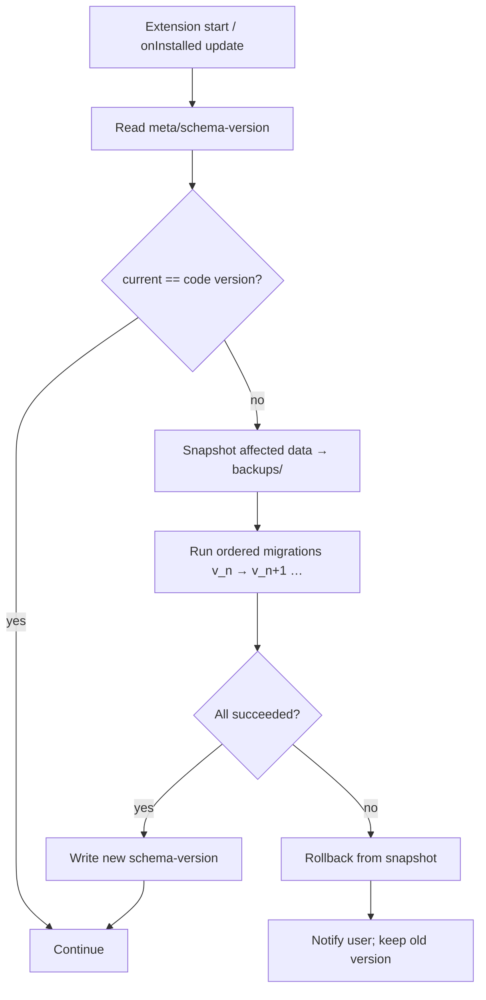

# 08 — Storage Plan

> Implementation-ready `chrome.storage.local` design, expanding `docs/12_STORAGE_DESIGN.md`. Covers structure, keys, indexes, envelopes, versioning, migration, backup, cleanup, limits, and optimization. Honors local-first (DD-005), project isolation (FR-024), and migration safety (security doc §1.17).

## 1. Storage Technology
- **Primary:** `chrome.storage.local` — persistent, offline, browser-managed, larger quota than `sync`.
- **Future:** `chrome.storage.sync` — settings/preferences only (small), never large datasets.
- **Cache:** transient data kept under a `cache/` root that is always safe to clear.

> ✅ **Decided (DD-035):** **request `unlimitedStorage`** for v1.0 so the local store is limited only by available disk, not the default ~5–10 MB quota. Data still lives locally in `chrome.storage.local` (on the user's disk, in the browser profile) — never in the cloud. v1.0 permission set: `storage`, `activeTab`, `scripting`, `unlimitedStorage`, `downloads`. The `downloads` permission powers JSON backup to the user's Downloads folder (**DD-039**), which is a *portable backup* — not the live store, because extensions cannot silently read files back on page load.

## 2. Top-level Layout

```text
chrome.storage.local
├── meta/                 # schema + extension version, install date, migration state
├── settings/             # global settings (outside any project)
├── projects/             # one workspace per detected project
│   └── <project-id>/
├── cache/                # transient: large response bodies, generated data, ui-state
└── backups/              # optional local snapshots (backup-001…)
```

## 3. Key Convention & Envelope

**Key:** `project-id/module/item-id` (e.g. `project_18af83/history/req_54`). Settings & meta use `settings/...` and `meta/...`.

**Every stored object is wrapped in an envelope** (suggested-improvement #3 in Analysis):

```ts
interface StorageEnvelope<T> {
  schemaVersion: number;     // schema version of THIS object
  createdVersion: string;    // extension semver at creation
  updatedVersion: string;    // extension semver at last write
  updatedAt: number;         // epoch ms
  data: T;                   // the actual payload
}
```

This makes per-object migration and debugging tractable and is required before any feature stores data (task T-01.1).

## 4. Per-Project Workspace

```text
projects/<project-id>/
├── metadata          # name, originUrl, openApiUrl, docType, createdAt, lastActiveEnv
├── authentication/
│   ├── active        # active credential for activeEnv
│   ├── profiles      # credential per environment
│   └── metadata
├── requests/
│   ├── drafts        # auto-saved per endpoint+env
│   ├── templates     # named templates per endpoint
│   └── metadata
├── environments/
│   ├── <env-id>      # name, baseUrl, variables, authRef, prefs
│   └── metadata      # activeEnvId, order
├── history/
│   ├── index         # lightweight index (see §6) for fast search/list
│   ├── records/<id>  # full request+response record (large body offloaded to cache)
│   └── metadata      # count, ringBufferCap
├── favorites/
│   └── endpoints
└── preferences/      # sidebar state, recents, productivity prefs
```

**Project ID generation** (FR-003, EC-007): stable hash of `origin + openApiUrl + docType`. Documented & unit-tested for stability across restarts; URL-change reconciliation attempts to match existing metadata before creating a new workspace.

## 5. Data Models (TypeScript)

```ts
// project metadata
interface ProjectMeta {
  id: string; name: string; originUrl: string; openApiUrl: string;
  docType: 'swagger-ui'; createdAt: number; lastActiveEnvId: string;
}

interface AuthRecord {                       // FDD-001
  type: 'bearer' | 'jwt' | 'apiKey' | 'basic';
  token: string;                             // masked in UI, never logged
  environmentId: string; updatedAt: number; lastUsed: number; expiresAt?: number;
}

interface RequestRecord {                    // FDD-002
  endpointId: string; method: string; environmentId: string;
  body?: string; headers?: Record<string,string>;
  query?: Record<string,string>; path?: Record<string,string>;
  contentType?: string; selectedExample?: string; updatedAt: number;
}
interface RequestTemplate extends RequestRecord { templateId: string; name: string; }

interface Environment {                      // FDD-003
  id: string; name: string; baseUrl: string;
  variables: Record<string,string>; authRef?: string;
  prefs?: Record<string,unknown>; updatedAt: number;
}

interface HistoryIndexEntry {                // lightweight, kept in history/index
  id: string; method: string; endpoint: string; status: number;
  durationMs: number; timestamp: number; environmentId: string; hasLargeBody: boolean;
}
interface HistoryRecord extends HistoryIndexEntry {  // FDD-004, full record
  request: { body?: string; headers?: Record<string,string>; query?: Record<string,string>; path?: Record<string,string>; };
  response: { body?: string; bodyRef?: string; headers?: Record<string,string>; contentType?: string; size: number; };
}

interface Settings {                          // FDD-010
  appearance: { theme: 'light'|'dark'|'system'; sidebarBehavior: string };
  shortcuts: Record<string,string>;
  storage: { lastWarnedAt?: number };
  notifications: Record<string,boolean>;
  privacy: Record<string,boolean>;
  advanced: Record<string,unknown>;
  schemaVersion: number;
}
```

## 6. Indexes
`chrome.storage.local` is a key-value store with no native indexing, so we maintain **explicit lightweight indexes**:

| Index | Lives at | Purpose |
|---|---|---|
| History index | `projects/<id>/history/index` | Array of `HistoryIndexEntry` for fast list/search/filter without loading full records (≤ ~200 bytes/entry). Full record + response body loaded lazily on demand. |
| Endpoint search index | built in-memory per session (Productivity) | Tokenized endpoint list for < 50 ms search at 5,000+ endpoints (EC-039). |
| Project registry | `meta/projects` | Map of project-id → name/lastActive for fast project lookup (EC-040). |
| Favorites | `projects/<id>/favorites/endpoints` | Set of endpoint IDs. |

Large response bodies are stored in `cache/responses/<id>` and referenced by `bodyRef` so the history index/records stay small and the cache can be evicted independently (mitigates R-02).

## 7. Versioning & Migration



- **Migration registry:** ordered list of `{from, to, migrate(store)}` run sequentially.
- **Safety:** snapshot before migrating; **rollback on any failure**; never partially migrate (EC-022 partial-save rollback, security §1.17).
- **Forward compat:** importing a **newer** schema is blocked with a clear message (EC-034); **older** is migrated if a path exists (EC-033).

## 8. Backup & Restore
- **In-storage snapshots:** `backups/backup-NNN` contain projects + settings + templates + collections(future) + environments. Created automatically before migrations.
- **Downloads-folder JSON backup (DD-039):** export Companion data as a JSON file to the user's **Downloads** folder via `chrome.downloads`, both **manually** ("Export now" in Settings) and via an **optional auto-snapshot** (periodic / on-significant-change), modeled on Firefox *Simple Tab Groups*. This is a portable, user-visible backup file on the PC — not the live store.
- **Restore:** via Settings file-picker import with schema validation + preview + duplicate handling (Replace/Merge/Rename/Cancel — EC-035). (Extensions cannot auto-read Downloads files, so restore is always an explicit user import.)
- The "exported file may contain secrets" warning (DD-037) applies to backup files.

## 9. Storage Limits & Cleanup
- **Monitor usage** via `chrome.storage.local.getBytesInUse`; `STORAGE_QUOTA_WARNING` retained as a safety net (if `unlimitedStorage` is unavailable or disk is low).
- **History ring buffer (DD-031):** `MAX_HISTORY_ITEMS` = **1000 per project** by default, user-configurable in Settings (range **100–10000**, or **"No limit"**). With `unlimitedStorage` (DD-035) this is a **performance** control (search/render/memory), not a quota wall. Large response bodies are still offloaded to `cache/responses/` to keep the history index small and search fast; oldest evicted first (silent, no per-eviction prompt).
- **User cleanup** (Settings): clear authentication / history / templates / cache / entire project / all data — each with confirmation (security §1.16).
- `cache/` may be cleared at any time without data loss.

## 10. Optimization
- Batch + debounce writes (T-01.3); coalesce rapid edits (Request auto-save).
- Read only the module namespace needed; lazy-load full history records.
- Keep indexes small; offload large blobs to `cache/`.
- Avoid unnecessary serialization; diff before write.
- Single-writer lock per project to prevent multi-tab races (R-04, EC-002/003).

## 11. Storage Security
- Tokens stored under `authentication/` only; **never** in logs; **never** shared across projects (FR-024, security §1.4).
- Export warns that the file may contain secrets (security §1.11); future option to exclude sensitive fields.
- Plaintext-at-rest is the confirmed v1.0 baseline (**DD-037**, pending security-reviewer sign-off) with strict handling (mask, never log, isolate, export warning); **optional passphrase-protected Web Crypto encryption** is planned as a v1.1 feature.

## 12. Future Expansion (no restructure required)
Plugin data, cloud sync, team workspaces, enterprise config, analytics prefs all attach as new top-level roots or new module namespaces — existing keys unchanged (storage success criterion + scalability requirement).
