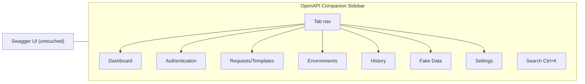

# 09 — UI Plan

> Every v1.0 screen/surface with **Purpose, Components, Interactions, States (incl. Loading & Errors), Accessibility.** Expands `docs/09_USER_FLOWS.md` and `docs/10_UI_UX_GUIDELINES.md`. Sidebar-first (DD-024), light/dark from day one (DD-025), keyboard-first (DD-026). Accessibility target: **WCAG 2.1 AA**.

## 0. Design System (shared by all screens)
- **Layout:** injected, collapsible right sidebar; **never overlaps Swagger controls**; original docs untouched.
- **Theme:** light/dark via Tailwind tokens; instant switch, no reload (EC-038). Color is never the sole status signal (icon + text too).
- **Type:** Inter / system-ui; body 14px, labels 12px, code monospace 12px.
- **Spacing:** 4/8/12/16/24/32 scale.
- **Motion:** ≤ 300 ms; panel slide 200 ms, fade 150 ms.
- **Toasts:** top/bottom-right, auto-dismiss 3–4 s, ARIA live region.
- **Performance budget (NFR):** sidebar open < 100 ms, search < 50 ms, request restore < 100 ms, history load < 200 ms, env switch < 200 ms.

### Canonical Keyboard Shortcuts (DD-038)
Ctrl on Windows/Linux, ⌘ on macOS. Shift-chords are used deliberately to avoid colliding with browser/OS single-modifier bindings. **All shortcuts are remappable in Settings → Shortcuts** with live collision detection (FR-019).

| Action | Shortcut | Note |
|---|---|---|
| Open/focus Search | `Ctrl/⌘ + K` | Industry-standard |
| Toggle Sidebar | `Ctrl/⌘ + Shift + O` | Truly global (manifest `commands`) |
| Save request as template | `Ctrl/⌘ + Shift + S` | Avoids browser Ctrl+S |
| Open History | `Ctrl/⌘ + Shift + H` | Avoids browser Ctrl+H |
| Open/switch Environments | `Ctrl/⌘ + Shift + E` | Avoids address-bar Ctrl+E |
| Generate fake data (focused field) | `Ctrl/⌘ + Shift + G` | — |
| Close top overlay/dialog | `Escape` | Universal |
| Navigation | `Tab / Shift+Tab / ↑ ↓ / Enter` | a11y nav |

**Collision policy:** in-page shortcuts are handled by the content script and `preventDefault` only for these reserved chords — never swallowing keys the browser or Swagger need. Only the truly global action(s) (toggle sidebar) use the manifest `commands` API; the rest are in-page.

---

## 1. Sidebar Shell
**Purpose:** persistent container + navigation; the entry to every feature (UF-002).
**Components:** logo/title, tab navigation, search trigger (Ctrl+K), environment selector, theme/collapse controls, active content slot, toast layer.
**Interactions:** click tab → switch panel (state-based, no router); `Ctrl+K` → search; collapse/expand persists across sessions; environment selector always visible.
**States:** *Collapsed* (icon rail), *Expanded*, *Dormant* (no Swagger detected → not injected, EC-005).
- *Loading:* skeleton tabs while stores hydrate.
- *Error:* "Companion failed to load — Swagger is unaffected. [Reload]" (never blocks Swagger).
**Accessibility:** landmark `complementary`; tabs as ARIA `tablist`/`tab`/`tabpanel`; full keyboard nav; Escape collapses; focus ring on all controls.

## 2. Dashboard
**Purpose:** at-a-glance project status + quick entry.
**Components:** project name/URL, active environment + auth status badges, recent APIs list, favorites, quick actions.
**Interactions:** click recent/favorite → open endpoint; quick action buttons.
**States:** *Populated*, *Empty* ("Execute a request to see activity here"), *Loading* (skeleton), *Error* (retry).
**Accessibility:** headings hierarchy; badges have text + icon.

## 3. Authentication Panel
**Purpose:** view/manage stored authorization (UF-004/005).
**Components:** status indicator (Authorized/None/Expired), masked token (show/hide), type label, "Clear authentication" (danger), restore confirmation.
**Interactions:** clear (confirm dialog); show/hide toggle; auto-restore happens on load (toast).
**States:** *None* (empty: explains auto-save on next authorize), *Authorized* (masked), *Expired* (warning badge + guidance, EC-008), *Loading* (validating/restoring spinner), *Error* ("Authentication failed — [reason]", EC-009).
**Accessibility:** token field `aria-label="API token, hidden"`; never auto-copies (clipboard safety §1.15); status announced via live region.

## 4. Requests / Templates Panel
**Purpose:** show save status, restore, manage templates (UF-006/007).
**Components:** save-status indicator, restore toast, template selector dropdown, template actions (save/duplicate/rename/delete), invalid-field highlight.
**Interactions:** auto-save is invisible; select template → populate fields (no execute); save current as template (Ctrl+Shift+S).
**States:** *No templates* (empty), *Has templates*, *Restoring* (brief), *Schema-changed* (warning: compatible fields restored, EC-012), *Error*.
**Accessibility:** dropdown is ARIA `combobox`; destructive actions confirmed; invalid fields use `aria-invalid` + text.

## 5. Environments Panel
**Purpose:** manage and switch environments (UF-008/009).
**Components:** environment selector (active highlighted), editor form (name, base URL, variables key/value), create/duplicate/delete, validation messages, active indicator.
**Interactions:** one-click switch (no refresh, < 200 ms); create/edit via form; delete (confirm) → fall back to default (EC-016).
**States:** *Loaded*, *Creating*, *Editing* (prefilled), *Switching* (brief indicator), *Validation error* (duplicate name EC-018, missing variable EC-017), *Error*.
**Accessibility:** form labels bound to inputs; variable rows keyboard-addable/removable; selector keyboard-navigable.

## 6. History Panel
**Purpose:** browse/replay executed requests (UF-011/012).
**Components:** search bar, filters (method, date range), virtualized list/timeline, per-row replay & delete, "clear all", request-details panel, basic response viewer (status/time/size/headers/pretty JSON).
**Interactions:** search (< 100 ms), filter, replay (logs new record), delete entry, clear project; row click → details.
**States:** *Empty* ("No requests executed yet"), *Loaded* (lazy/virtualized at scale EC-023/039), *Searching*, *No results*, *Loading*, *Error* (retry), *Deleted-endpoint replay* warning (EC-013).
**Accessibility:** list as table with sortable headers; replay/delete are labeled buttons; details panel focus-managed.

## 7. Fake Data Generator
**Purpose:** populate fields with realistic data (UF-010).
**Components:** per-field generate button/icon, regenerate, "Generate all", success/fallback messaging.
**Interactions:** click generate → instant insert (< 20 ms); generate-all preserves manual edits; unsupported field → message, value unchanged (EC-029).
**States:** *Idle*, *Generating* (brief), *Generated*, *Unsupported field* (fallback), *Error*.
**Accessibility:** generate buttons labeled with field name; result announced; no focus theft.

## 8. Settings Panel
**Purpose:** configuration, storage, data portability, info (UF-015/016/017).
**Components:** category nav (Appearance / Storage / Data / General); theme selector; storage usage + per-project & all clear; export (module checkboxes) + **Downloads-folder backup (manual "Export now" + auto-snapshot toggle, DD-039)** + import (file picker, validation, preview); reset; version/build + links; confirmation dialogs; export-secrets warning.
**Interactions:** theme switch instant; export/backup → JSON to Downloads (< 500 ms); import → validate → preview → confirm (duplicate strategy); destructive actions confirmed.
**States:** *Loaded*, *Saving* (brief), *Exporting/Backing up*, *Importing/Validating*, *Import invalid* (EC-032/034 explained), *Error*.
**Accessibility:** category nav as tablist; file picker labeled; dialogs trap focus, Escape cancels.

## 9. Global Search Dialog
**Purpose:** jump to endpoints/requests/templates/history fast (Ctrl+K).
**Components:** search input, grouped results (endpoints/templates/history), keyboard navigation, result preview.
**Interactions:** type → instant results (< 50 ms); ↑/↓ navigate; Enter select; Escape close.
**States:** *Closed*, *Open/empty*, *Typing*, *Results*, *No results* ("No results for '…'").
**Accessibility:** ARIA `combobox` + `listbox`; active option `aria-activedescendant`; fully keyboard-operable; focus returns to trigger on close.

## 10. Notifications / Toasts
**Purpose:** non-intrusive feedback (FR-020).
**Components:** success/warning/error toasts with optional action.
**Interactions:** auto-dismiss; manual dismiss; optional action button.
**States:** per kind; stacking with max visible.
**Accessibility:** ARIA live region (`polite` for success/info, `assertive` for error); never the only feedback for critical errors (also inline).

## 11. Modal Dialogs
**Purpose:** confirm critical/destructive actions only (delete, reset, large import).
**Components:** title, description, Cancel + Confirm (danger styling for destructive).
**Interactions:** focus trap; Escape = cancel; Enter = default action; backdrop click cancels.
**States:** *Open*, *Submitting* (disabled + spinner), *Error*.
**Accessibility:** `role="dialog"` + `aria-modal`; labelled by title; focus moves in on open, returns on close.

## 12. First-Run / Onboarding (UF-001)
**Purpose:** on install, seed defaults; on first Swagger visit, a one-time hint that Companion is active.
**Components:** subtle first-run toast/tooltip pointing at the sidebar; link to user guide.
**States:** shown once (persisted flag), then never again.
**Accessibility:** dismissible, keyboard-reachable, non-blocking.

---

## Cross-Screen UX Rules (from `docs/10`)
- Remember state across sessions; avoid repeated confirmations; minimize clicks; preserve progress automatically.
- Every screen defines recovery for: network failure, invalid data, missing/corrupted storage, unsupported page, permission denied, browser restart, extension update.
- Responsive from 1366×768 up; sidebar collapses on narrow widths (EC-036); body never horizontally scrolls (wide content scrolls within its own container).
- Empty states always offer the next action (e.g. "Create your first environment").
