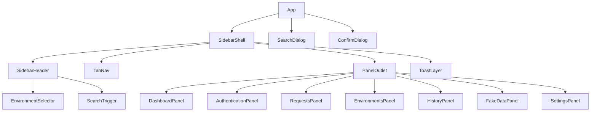

# 10 — Component Plan

> The full React component tree for v1.0, mapping `09_UI_PLAN.md` screens to concrete components. Components are **presentational** — they read Zustand stores via hooks and dispatch intent to services (no direct storage/adapter access; architecture rule). Shared components carry no business logic. Naming: `PascalCase` components, `useXxx` hooks (per `docs/20_CONTRIBUTING.md`).

## 1. Component Tree

```text
<App>                                  # sidebar/App.tsx — theme provider, event-bus binding
├── <SidebarShell>                     # layout, collapse state, landmarks
│   ├── <SidebarHeader>
│   │   ├── <Logo />
│   │   ├── <EnvironmentSelector />    # shared with Environments panel
│   │   ├── <SearchTrigger />          # opens <SearchDialog/> (Ctrl+K)
│   │   ├── <ThemeToggle />
│   │   └── <CollapseButton />
│   ├── <TabNav>                       # ARIA tablist
│   │   └── <TabItem* />               # Dashboard/Auth/Requests/Env/History/FakeData/Settings
│   ├── <PanelOutlet>                  # renders active panel (lazy-loaded)
│   │   ├── <DashboardPanel />
│   │   ├── <AuthenticationPanel />
│   │   ├── <RequestsPanel />
│   │   ├── <EnvironmentsPanel />
│   │   ├── <HistoryPanel />
│   │   ├── <FakeDataPanel />
│   │   └── <SettingsPanel />
│   └── <ToastLayer />                 # ARIA live region
├── <SearchDialog />                   # overlay (combobox/listbox)
├── <FakeDataFloatingPanel />          # field-anchored generator
└── <ConfirmDialog />                  # singleton, controlled by dialog store
```



## 2. Shared Design-System Components (`src/components/`)
No business logic; styled with Tailwind tokens; all keyboard + ARIA compliant.

| Component | Props (key) | Notes |
|---|---|---|
| `<Button>` | `variant: primary\|secondary\|danger\|icon`, `loading`, `disabled` | Icon variant requires `aria-label` |
| `<TextInput>` / `<Textarea>` | `value`, `onChange`, `error`, `label` | `aria-invalid` on error |
| `<Select>` / `<Combobox>` | `options`, `value`, `onChange` | ARIA listbox; keyboard nav |
| `<Checkbox>` / `<Radio>` | `checked`, `onChange`, `label` | — |
| `<Table>` | `columns`, `rows`, `sort`, `onSort`, `virtualized` | Virtualized mode for History/large lists |
| `<Dialog>` / `<ConfirmDialog>` | `open`, `title`, `onConfirm`, `onCancel`, `danger` | Focus trap, Escape cancels |
| `<Toast>` / `<ToastLayer>` | `kind`, `message`, `action` | Live region; auto-dismiss |
| `<Badge>` | `kind: success\|warning\|error\|info` | Icon + text |
| `<EmptyState>` | `icon`, `message`, `actionLabel`, `onAction` | Always offers next action |
| `<Spinner>` / `<Skeleton>` | `size` | Loading states |
| `<Tooltip>` / `<Popover>` | `content` | Keyboard-dismissible |
| `<KeyValueEditor>` | `pairs`, `onChange` | Reused by Environments (variables) & headers |
| `<CodeBlock>` | `code`, `language`, `copyable` | Pretty JSON / generated code |
| `<MaskedValue>` | `value`, `revealable` | Tokens; never auto-copy |

## 3. Per-Panel Components

### DashboardPanel
`<ProjectSummaryCard>`, `<AuthStatusBadge>`, `<ActiveEnvBadge>`, `<RecentApisList>`, `<FavoritesList>`, `<QuickActions>`.

### AuthenticationPanel
`<AuthStatusIndicator>`, `<MaskedValue>` (token), `<AuthTypeLabel>`, `<ClearAuthButton>` (danger + confirm), `<RestoreNotice>`.
Hook: `useAuthentication()` → reads auth store, calls `AuthenticationService`.

### RequestsPanel
`<SaveStatusIndicator>`, `<TemplateSelector>` (`<Combobox>`), `<TemplateActions>` (save/duplicate/rename/delete), `<InvalidFieldNotice>`, `<RestoreNotice>`.
Hook: `useRequest(endpointId)`.

### EnvironmentsPanel
`<EnvironmentSelector>` (shared), `<EnvironmentForm>` (`<TextInput>` name/baseURL + `<KeyValueEditor>` variables), `<EnvironmentActions>` (create/duplicate/delete), `<ActiveEnvIndicator>`, `<ValidationMessages>`.
Hook: `useEnvironments()`.

### HistoryPanel
`<HistorySearchBar>`, `<HistoryFilters>` (method, date), `<HistoryTable>` (virtualized `<Table>`), `<HistoryRowActions>` (replay/delete), `<ClearHistoryButton>` (confirm), `<RequestDetailsPanel>`, `<ResponseViewer>` (status/time/size/headers + `<CodeBlock>` pretty JSON).
Hook: `useHistory()`.

### FakeDataPanel / FakeDataFloatingPanel
`<GenerateFieldButton>`, `<RegenerateButton>`, `<GenerateAllButton>`, `<GenerationResultNotice>`.
Hook: `useFakeData()`.

### SettingsPanel
`<SettingsCategoryNav>` (tablist), `<AppearanceSettings>` (`<ThemeSelector>`), `<StorageSettings>` (`<StorageUsageMeter>`, `<ClearDataButtons>`), `<DataManagement>` (`<ExportDialog>` w/ module checkboxes, `<ImportDialog>` w/ `<FilePicker>` + `<ImportPreview>`), `<GeneralInfo>` (version/build/links), `<ResetButton>` (danger + confirm).
Hook: `useSettings()`.

### SearchDialog
`<SearchInput>`, `<SearchResultGroup>` (endpoints/templates/history), `<SearchResultItem>`, keyboard navigation controller.
Hook: `useSearch()`.

## 4. Hooks (`src/hooks/` + per-module `hooks.ts`)
| Hook | Bridges |
|---|---|
| `useProject()` | project store ↔ ProjectService |
| `useAuthentication()` | auth store ↔ AuthenticationService |
| `useRequest(endpointId)` | request store ↔ RequestService |
| `useEnvironments()` | env store ↔ EnvironmentService |
| `useHistory()` | history store ↔ HistoryService |
| `useFakeData()` | FakeDataService |
| `useSearch()` / `useFavorites()` / `useRecents()` | ProductivityService |
| `useSettings()` / `useTheme()` | SettingsService / ThemeManager |
| `useToast()` | NotificationService |
| `useEventBus(event, handler)` | subscribe + auto-unsubscribe on unmount |
| `useKeyboardShortcut(combo, handler)` | global shortcut registration |

## 5. Stores (`src/stores/` + per-module `store.ts`)
Minimal global state (DD-009): `projectStore`, `environmentStore`, `themeStore`, `settingsStore`, `dialogStore`, `toastStore`. Feature state local to each module store (`auth`, `request`, `history`, `productivity`). Stores subscribe to relevant events (`12`) to stay fresh.

## 6. Component Conventions
- Functional components + hooks only; small, single-responsibility (CONTRIBUTING).
- Separate UI from logic: components never import services' storage/adapter internals — only through hooks.
- Lazy-load heavy panels (`HistoryPanel`, `ResponseViewer`) via `React.lazy`.
- Memoize list rows; virtualize long lists.
- Every interactive element: keyboard-operable, focus-visible, ARIA-labelled (WCAG 2.1 AA).
- Each component ships with an RTL unit test + axe smoke (see `13_TEST_PLAN.md`).

## 7. v1.1+ components (not built in v1.0)
`<CollectionsPanel>` (v1.1), `<WorkflowsPanel>` + `<WorkflowRunner>` (v1.2), enhanced `<ResponseInspector>` with tree view + compare (v1.3) — slot into `<PanelOutlet>` + `<TabNav>` without changing existing components (architecture scalability rule).
