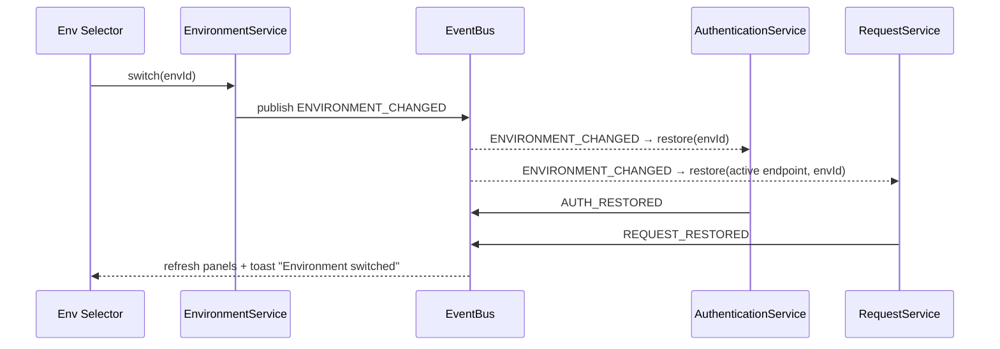

# 12 — Event System

> The complete event bus for v1.0. Modules never call each other directly; they communicate only through these events (architecture rule). Each event lists **Publisher, Subscribers, Payload, Lifecycle.** The typed payload map is the contract `EventBus` enforces (`11_SERVICE_PLAN.md`).

## 1. Design
- **Synchronous, in-process pub/sub** within the sidebar app context; cross-context (content ↔ background) messages are bridged and re-published locally.
- **Typed**: a single `EventPayload` map keys every event to its payload type — no stringly-typed events.
- **Resilient**: a throwing subscriber is caught and logged; it never breaks delivery to others.
- **Naming**: `DOMAIN_PASTTENSE` (e.g. `AUTH_RESTORED`). Adapter-origin browser events use a `swagger:` prefix.

```ts
type EventName = keyof EventPayload;
interface EventPayload {
  PROJECT_DETECTED: { projectId: string; docType: string };
  PROJECT_CHANGED: { projectId: string };
  AUTH_UPDATED: { projectId: string; environmentId: string; type: string };
  AUTH_RESTORED: { projectId: string; environmentId: string };
  AUTH_CLEARED: { projectId: string; environmentId: string };
  AUTH_EXPIRED: { projectId: string; environmentId: string };
  REQUEST_CHANGED: { endpointId: string; environmentId: string };
  REQUEST_RESTORED: { endpointId: string; environmentId: string };
  TEMPLATE_SAVED: { templateId: string; endpointId: string };
  TEMPLATE_DELETED: { templateId: string };
  ENVIRONMENT_CHANGED: { projectId: string; environmentId: string };
  ENVIRONMENT_CREATED: { environmentId: string };
  ENVIRONMENT_DELETED: { environmentId: string };
  HISTORY_RECORDED: { recordId: string; endpointId: string; status: number };
  REQUEST_REPLAYED: { sourceId: string; newRecordId: string };
  HISTORY_CLEARED: { projectId: string };
  FAKE_DATA_GENERATED: { endpointId: string; fieldCount: number };
  FAVORITE_TOGGLED: { endpointId: string; favorite: boolean };
  RECENT_UPDATED: { endpointId: string };
  SETTINGS_UPDATED: { keys: string[] };
  THEME_CHANGED: { theme: 'light' | 'dark' | 'system' };
  STORAGE_MIGRATED: { from: number; to: number };
  STORAGE_QUOTA_WARNING: { bytesInUse: number; quota: number };
  DATA_IMPORTED: { summary: ImportSummary };
  DATA_EXPORTED: { modules: string[] };
  DATA_BACKED_UP: { modules: string[]; auto: boolean; filename: string };
  DATA_RESET: Record<string, never>;
  NOTIFY: { kind: 'success' | 'warning' | 'error'; message: string };
}
```

## 2. Event Catalog

### Project
| Event | Publisher | Subscribers | Payload | Lifecycle |
|---|---|---|---|---|
| `PROJECT_DETECTED` | ProjectService | Auth, Request, Env, History, Productivity, Sidebar | `{projectId, docType}` | Once per page init after detection |
| `PROJECT_CHANGED` | ProjectService | all stores | `{projectId}` | On navigation to a different project/URL (EC-007) |

### Authentication
| Event | Publisher | Subscribers | Payload | Lifecycle |
|---|---|---|---|---|
| `AUTH_UPDATED` | AuthenticationService | Sidebar (status), Notification | `{projectId,environmentId,type}` | After a successful save |
| `AUTH_RESTORED` | AuthenticationService | Sidebar, Notification | `{projectId,environmentId}` | After restore on load (< 100 ms) |
| `AUTH_CLEARED` | AuthenticationService | Sidebar, Notification | `{projectId,environmentId}` | After manual clear / logout (EC-011) |
| `AUTH_EXPIRED` | AuthenticationService | Sidebar, Notification | `{projectId,environmentId}` | On detected expiry (EC-008) — no auth loop |

### Request
| Event | Publisher | Subscribers | Payload | Lifecycle |
|---|---|---|---|---|
| `REQUEST_CHANGED` | RequestService | Sidebar (save status) | `{endpointId,environmentId}` | After debounced auto-save (≤ 300 ms idle) |
| `REQUEST_RESTORED` | RequestService | Sidebar, Notification | `{endpointId,environmentId}` | After restore on endpoint open (< 150 ms) |
| `TEMPLATE_SAVED` | RequestService | Sidebar (template list), Productivity | `{templateId,endpointId}` | On template create/duplicate/rename |
| `TEMPLATE_DELETED` | RequestService | Sidebar, Productivity | `{templateId}` | On template delete |

### Environment
| Event | Publisher | Subscribers | Payload | Lifecycle |
|---|---|---|---|---|
| `ENVIRONMENT_CHANGED` | EnvironmentService | Auth, Request, History, Sidebar, Notification | `{projectId,environmentId}` | On switch — triggers auth+request re-load |
| `ENVIRONMENT_CREATED` | EnvironmentService | Sidebar (selector) | `{environmentId}` | On create/duplicate |
| `ENVIRONMENT_DELETED` | EnvironmentService | Sidebar, History | `{environmentId}` | On delete — fall back to default (EC-016) |

### History
| Event | Publisher | Subscribers | Payload | Lifecycle |
|---|---|---|---|---|
| `HISTORY_RECORDED` | HistoryService | Sidebar (list), Productivity (recents) | `{recordId,endpointId,status}` | After each executed request recorded |
| `REQUEST_REPLAYED` | HistoryService | Sidebar, Notification | `{sourceId,newRecordId}` | On replay — logs a new record |
| `HISTORY_CLEARED` | HistoryService | Sidebar | `{projectId}` | On clear-project-history (auth/templates untouched) |

### Fake Data / Productivity
| Event | Publisher | Subscribers | Payload | Lifecycle |
|---|---|---|---|---|
| `FAKE_DATA_GENERATED` | FakeDataService | Sidebar, Notification | `{endpointId,fieldCount}` | After field/all generation |
| `FAVORITE_TOGGLED` | ProductivityService | Sidebar (favorites) | `{endpointId,favorite}` | On favorite add/remove |
| `RECENT_UPDATED` | ProductivityService | Sidebar (recents) | `{endpointId}` | On endpoint access |

### Settings / Storage / Data
| Event | Publisher | Subscribers | Payload | Lifecycle |
|---|---|---|---|---|
| `SETTINGS_UPDATED` | SettingsService | affected stores | `{keys}` | On any settings change (applied immediately) |
| `THEME_CHANGED` | SettingsService/ThemeManager | Sidebar (root) | `{theme}` | On theme switch — instant, no reload (EC-038) |
| `STORAGE_MIGRATED` | MigrationService | Sidebar, Notification | `{from,to}` | After successful migration (EC-042) |
| `STORAGE_QUOTA_WARNING` | StorageService | Sidebar, Notification, Settings | `{bytesInUse,quota}` | When usage nears limit (EC-019) |
| `DATA_IMPORTED` | ImportExportService | all stores, Notification | `{summary}` | After validated import (EC-032…035) |
| `DATA_EXPORTED` | ImportExportService | Notification | `{modules}` | After export (< 500 ms) |
| `DATA_BACKED_UP` | ImportExportService | Notification, Settings | `{modules,auto,filename}` | After a Downloads-folder backup (manual or auto-snapshot — DD-039) |
| `DATA_RESET` | SettingsService | all stores, Notification | `{}` | After reset-to-defaults |
| `NOTIFY` | any service | NotificationService | `{kind,message}` | Generic toast request |

### Adapter-origin (bridged)
| Event | Publisher | Subscribers | Payload | Lifecycle |
|---|---|---|---|---|
| `swagger:authChanged` | SwaggerAdapter | AuthenticationService | `AuthSnapshot` | When Swagger authorization changes |
| `swagger:requestChanged` | SwaggerAdapter | RequestService | `RequestSnapshot` | When a "Try it out" field changes |
| `swagger:execute` | SwaggerAdapter | HistoryService | `{endpointId,request,response}` | When a request executes (capture for History) |

## 3. Representative Event Choreography

**Environment switch** (one event fans out to re-load auth + requests):



## 4. Subscription Rules
- A module **subscribes only to events it needs** (architecture: "every module subscribes only to relevant events").
- Subscriptions are registered on module init and **unsubscribed on teardown** (content-script cleanup, EC-043) to avoid leaks/duplicate handlers (security §1.13).
- No event handler may write to another module's storage namespace — it calls that module's service or emits an event.

## 5. Testing
- Each publisher has a unit test asserting the event + payload shape.
- Each subscriber has a unit test reacting to a mocked event.
- Integration tests assert choreographies (e.g. environment switch above).
- Event contract is type-checked at compile time via `EventPayload`.
