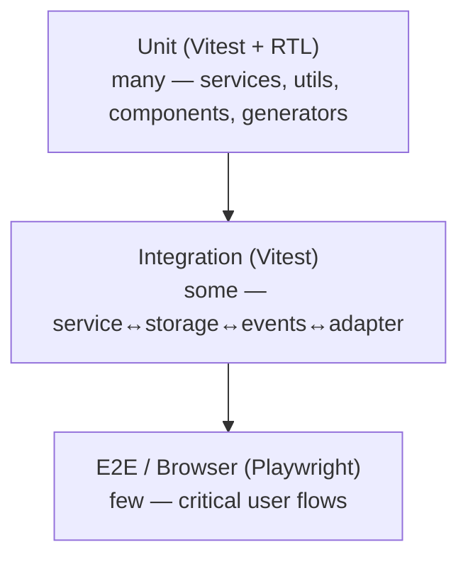

# 13 — Test Plan

> Test strategy for v1.0, expanding the (truncated) `docs/15_TESTING_STRATEGY.md` and honoring DD-029/DD-030 (every feature needs unit + integration + E2E; a feature isn't done until edge cases are tested). Tools: **Vitest** (unit/integration), **React Testing Library** (components), **Playwright** (E2E/browser). Coverage targets below are **confirmed (DD-034)**.

## 1. Test Pyramid

## 2. Layers, Scope & Tooling

| Layer | Tool | Scope | Examples |
|---|---|---|---|
| Unit | Vitest | Pure logic in isolation (mock Storage/Adapter) | generators, variable resolver, project-ID hash, code generators, envelope (de)serialization |
| Component | Vitest + RTL | Rendering, interaction, a11y of components | `<TemplateSelector>`, `<HistoryTable>`, `<ConfirmDialog>`, `<SearchDialog>` |
| Integration | Vitest | Service ↔ StorageService ↔ EventBus ↔ Adapter (real wiring, fake DOM) | save→restore auth; env switch re-loads auth+request; migration `v0→v1`; multi-tab write lock |
| E2E / Browser | Playwright | Full flows against Swagger UI fixtures in a real Chromium with the extension loaded | UF-001…UF-012, UF-015…UF-017 |
| Non-functional | mixed | Performance, security, a11y, cross-browser | NFR benchmarks, security checklist, axe, browser matrix |

## 3. Coverage Targets (confirmed — DD-034)
| Area | Statements/Branches | Rationale |
|---|---|---|
| Services & utils (`core/`, `modules/*/service.ts`, `utils/`) | **≥ 80%** | Highest-risk business logic |
| Stores & hooks | ≥ 70% | State transitions |
| Components | ≥ 60% | Behavior over pixels; a11y smoke required |
| Adapters | Critical-path covered + version-matrix fixtures | DOM coupling (R-01) |
| **Every documented edge case (EC-001…048)** | 100% have at least one automated or manual-QA test | DD-029 |

Coverage is enforced in CI (see `15_CI_CD.md`); PRs that drop coverage below threshold fail.

## 4. E2E Critical-Flow Matrix
Each maps to a user flow and runs on a Swagger UI fixture with the unpacked extension.

| Test | Flow | Assertion |
|---|---|---|
| E2E-01 | UF-001 First install | Defaults seeded; sidebar dormant until Swagger |
| E2E-02 | UF-002/003 Init + detect | Sidebar injects; project + default env created; Swagger unaffected |
| E2E-03 | UF-004 Auth save | Authorizing persists masked credential |
| E2E-04 | UF-005 Auth restore | After refresh, auth restored < 100 ms |
| E2E-05 | UF-006 Save request | Editing auto-saves (≤ 300 ms) |
| E2E-06 | UF-007 Restore request | Revisit endpoint restores fields; no auto-execute |
| E2E-07 | Templates | Save/duplicate/rename/delete persist; load populates |
| E2E-08 | UF-008/009 Env create/switch | One-click switch < 200 ms; auth+request re-load; no leakage |
| E2E-09 | UF-010 Fake data | Generate field/all; manual edits preserved |
| E2E-10 | UF-011 History record | Executed request recorded with metadata |
| E2E-11 | UF-012 Replay | Replay logs new record; templates untouched |
| E2E-12 | Productivity | Ctrl+K search; copy-as cURL/Fetch/Axios |
| E2E-13 | UF-015 Settings/theme | Theme switches instantly, persists |
| E2E-14 | UF-016/017 Import/Export | Round-trip; invalid import rejected safely |
| E2E-15 | EC-043 Disable | Disabling extension leaves Swagger fully functional |

## 5. Edge-Case Test Mapping (EC-001…EC-048)
Grouped by module; each EC has a unit/integration test and, where UI-visible, an E2E or manual-QA step (sweep task T-10.1).

| Group | Edge cases | Primary layer |
|---|---|---|
| Browser/lifecycle | EC-001…004, EC-042…044 | Integration + manual |
| Project detection | EC-005…007 | Unit + E2E |
| Authentication | EC-008…011 | Unit + E2E |
| Request | EC-012…015 | Unit + integration |
| Environment | EC-016…018 | Unit + E2E |
| Storage | EC-019…022 | Integration (mock quota/corruption) |
| History | EC-023…025 | Integration + perf |
| Fake data | EC-029…031 | Unit |
| Import/export | EC-032…035 | Unit + integration |
| UI/Performance | EC-036…041 | Component + perf |
| Security | EC-045…048 | Unit + security suite |

> Workflow/Collections/Response-Inspector edge cases (EC-026…028, EC-041 collections) are v1.1+ and out of v1.0 scope.

## 6. Performance Tests (NFR benchmarks)
Automated benchmarks assert the documented targets; fail the build if regressed beyond tolerance.

| Metric | Target | Test |
|---|---|---|
| Auth restore | < 100 ms | E2E timing |
| Request restore | < 150 ms | E2E timing |
| Env switch | < 200 ms | E2E timing |
| Search | < 50 ms @ 5,000 endpoints | Bench |
| History search | < 100 ms @ thousands | Bench |
| Fake data field / all | < 20 ms / < 150 ms | Bench |
| Code generation | < 30 ms | Bench |
| Bundle size | within budget | CI size check |

## 7. Security Tests (per `docs/13` checklist)
- Import validation: malformed/malicious/older/newer schema (EC-032…035, EC-045, EC-047).
- Token handling: never logged (static lint rule + runtime test), masked, not auto-copied (EC clipboard).
- Project isolation: no cross-project read/write (fuzz with two projects).
- XSS: untrusted content escaped, no unsafe HTML rendering (EC-046).
- Permissions: assert manifest requests exactly `storage`, `activeTab`, `scripting`, `unlimitedStorage`, `downloads` (DD-035) — and no others.
- Migration safety: rollback on failure, no data loss (EC-022, EC-042).
- Dependency audit: `npm audit` gate.

## 8. Accessibility Tests (WCAG 2.1 AA)
- `axe-core` smoke on every panel + dialog.
- Manual screen-reader pass (VoiceOver/NVDA) on critical flows.
- Keyboard-only traversal of every interactive element; visible focus; Escape closes overlays.
- Contrast checks for light & dark themes.

## 9. Cross-Browser Matrix (Phase 9)
| Browser | Smoke | Critical flows |
|---|---|---|
| Chrome | ✓ | ✓ |
| Edge | ✓ | ✓ |
| Brave | ✓ | ✓ |
| Arc | ✓ | sampled |
| Opera | ✓ | sampled |

Swagger version fixtures: Swagger UI **3.x, 4.x, 5.x** for adapter regression (R-01).

## 10. Test Data & Fixtures
- Swagger UI fixture pages (per major version) served locally in E2E.
- Sample OpenAPI specs: small, medium, and a **5,000-endpoint** spec for perf.
- Seeded storage states for migration and import tests.

## 11. CI Integration & Gates
- PR pipeline: lint → typecheck → unit/component → integration → build → E2E (smoke subset) — see `15_CI_CD.md`.
- Nightly/`main`: full E2E + perf + a11y + cross-browser matrix.
- Merge blocked on: any failing test, coverage below threshold, `npm audit` high/critical, bundle over budget.

## 12. Manual QA Checklist (per release)
Functional pass on each module; edge-case spot checks; install/upgrade/migration on a populated store; disable/re-enable; incognito behavior (EC-004); slow-machine behavior (EC-037). Documented in `19_RELEASE_PLAN.md` release checklist.
