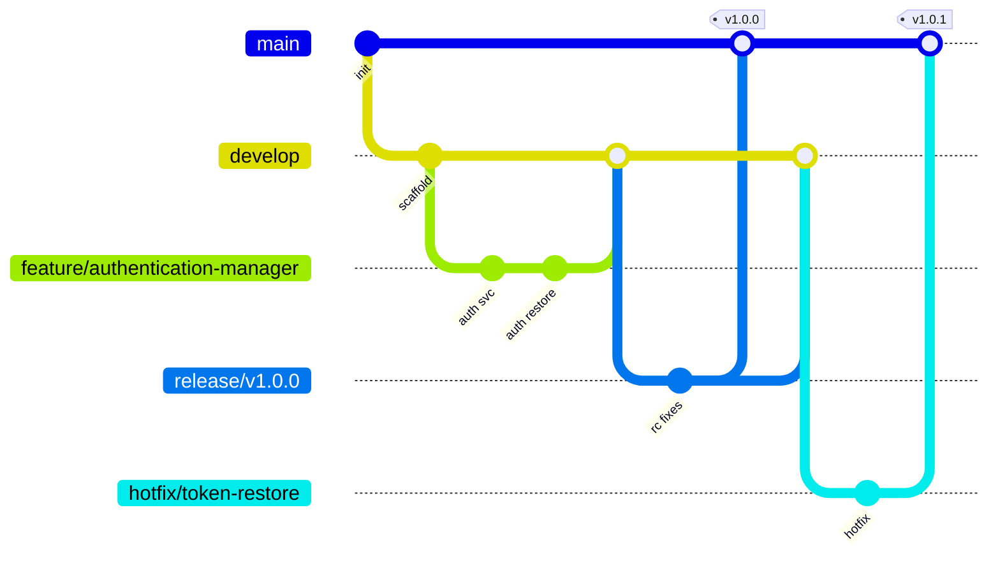

# 14 — Git Strategy

> Branching, versioning, commits, PRs, and review for an open-source, multi-contributor project. Formalizes the conventions already drafted in `docs/20_CONTRIBUTING.md` into an enforceable workflow.

## 1. Branch Model (GitFlow-lite)



| Branch | Purpose | Protected | Merges into |
|---|---|---|---|
| `main` | Production-ready, released code; every commit is releasable | ✅ | — (tagged releases) |
| `develop` | Integration branch for the next release | ✅ | `main` via `release/*` |
| `feature/<name>` | One feature/epic story | — | `develop` |
| `bugfix/<id>` | Non-urgent bug fix | — | `develop` |
| `release/<version>` | Stabilize a release; only fixes/docs/version bumps | ✅ | `main` + back-merge to `develop` |
| `hotfix/<issue>` | Urgent production fix | — | `main` + back-merge to `develop` |

**Naming examples** (from CONTRIBUTING): `feature/authentication-manager`, `feature/request-history`, `bugfix/token-restore`, `release/v1.0.0`, `hotfix/auth-loop`.

## 2. Versioning — Semantic Versioning
`MAJOR.MINOR.PATCH` (from `docs/17_ROADMAP.md` / `docs/21_CHANGELOG.md`):
- **MAJOR** — breaking changes (e.g. 2.0.0 team collaboration).
- **MINOR** — backward-compatible features (1.1.0 Collections, 1.2.0 Workflow Runner, 1.3.0 Response Comparison, 1.4.0 ReDoc, 1.5.0 Firefox).
- **PATCH** — backward-compatible fixes (1.0.1, …).

Storage **schema version** is tracked independently in `meta/` and bumped via the migration registry (`08_STORAGE_PLAN.md`) — a schema bump does not require a MAJOR app bump, but every release records its schema version.

Release cadence (roadmap): MAJOR every 6–12 months, MINOR every 1–2 months, PATCH as needed.

## 3. Commit Convention — Conventional Commits
`type(scope): subject` (from CONTRIBUTING). Enforced by commitlint in CI + a commit-msg hook.

**Types:** `feat`, `fix`, `docs`, `refactor`, `test`, `perf`, `chore`, `build`, `ci`, `style`, `revert`.
**Scopes:** module/area, e.g. `authentication`, `request`, `environment`, `history`, `fake-data`, `productivity`, `settings`, `storage`, `ui`, `adapter`, `events`, `ci`.

Examples (from CONTRIBUTING):
```
feat(authentication): add persistent authorization
fix(history): resolve duplicate request issue
docs(storage): update storage schema
refactor(ui): simplify sidebar layout
test(workflow): add replay tests
```
- Breaking change: `feat(storage)!: …` or a `BREAKING CHANGE:` footer.
- Reference issues in the footer: `Closes #123`.
- Conventional Commits drive automated changelog generation (`19_RELEASE_PLAN.md`).

## 4. Pull Requests

**PR title:** Conventional-Commit style (becomes the squash-merge commit).

**PR template** (`.github/pull_request_template.md`) — from CONTRIBUTING checklist:
```markdown
## What & Why
<problem this solves>

## Solution
<approach>

## Screenshots (UI changes)

## Checklist
- [ ] Clear title (Conventional Commit)
- [ ] Tests added/updated (unit/integration/E2E as applicable)
- [ ] Documented edge cases handled & tested
- [ ] Docs updated (feature spec / user stories / changelog / design decisions)
- [ ] No lint errors, no type errors
- [ ] No tokens/secrets logged; security guidelines respected
- [ ] Accessibility checks for new UI (keyboard, ARIA, focus, contrast)
- [ ] Acceptance criteria satisfied
- [ ] No known regressions
```

**Merge policy:**
- **Squash merge** into `develop`/`main` (linear history; one Conventional Commit per PR).
- All CI checks green + ≥ 1 approving review (CODEOWNERS for touched module) + up-to-date with base.
- No direct pushes to `main`/`develop`/`release/*` (branch protection).

## 5. Code Review Checklist (reviewers verify — from CONTRIBUTING)
Correctness · Readability · Performance · Security · Test coverage · Documentation · Architectural consistency.
Plus project-specific gates:
- Respects dependency rules (no `UI→Storage`, no cross-module imports, DOM only in adapter).
- New module follows the standard module shape.
- Edge cases from the relevant FDD/`14_EDGE_CASES` covered.
- No new `any`/`@ts-ignore`/`eslint-disable` without a `// DEBT(TD-NN)` marker + backlog item (`18_TECH_DEBT.md`).

## 6. Git Hooks (Husky + lint-staged)
| Hook | Action |
|---|---|
| `pre-commit` | lint-staged: ESLint + Prettier on staged files; block on error |
| `commit-msg` | commitlint (Conventional Commits) |
| `pre-push` | typecheck + affected unit tests |

## 7. Repository Governance
- **CODEOWNERS** per module/area → required reviewer.
- **Branch protection** on `main`/`develop`/`release/*`: required checks, required review, no force-push, linear history.
- **Issue templates**: bug report, feature request, security report (`SECURITY.md` for private disclosure).
- **Labels**: `type:feat|fix|docs`, `priority:P0..P4`, `status:blocked|in-progress`, `area:<module>`, `good-first-issue`.
- Tags annotated and signed where possible; GitHub Release per tag (`19_RELEASE_PLAN.md`).

## 8. Tagging & Release Flow (summary)
1. Cut `release/vX.Y.Z` from `develop`.
2. Stabilize (fixes/docs/version bump + changelog finalize).
3. Merge to `main`, tag `vX.Y.Z`, publish GitHub Release + Web Store package.
4. Back-merge `release/*` into `develop`.
5. Hotfixes branch from `main`, merge back to both. Full detail in `19_RELEASE_PLAN.md`.
