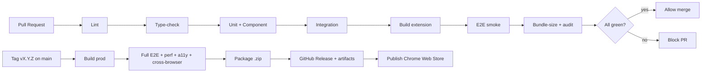

# 15 — CI/CD Plan

> GitHub Actions pipeline for OpenAPI Companion: lint, type-check, test, build, package, release, artifacts. Enforces the quality gates from `13_TEST_PLAN.md`, `14_GIT_STRATEGY.md`, and `18_TECH_DEBT.md`. The product is a client-side browser extension — "deploy" means **packaging + Chrome Web Store publication**, not server deployment.

## 1. Pipeline Overview

## 2. Workflows

### `ci.yml` — on every PR & push to `develop`
| Job | Command | Gate |
|---|---|---|
| Lint | `npm run lint` (ESLint + Prettier check) | fail on error |
| Type-check | `npm run typecheck` (`tsc --noEmit`, strict) | fail on error |
| Commitlint | `commitlint` on PR commits/title | Conventional Commits |
| Unit + Component | `npm run test:unit -- --coverage` (Vitest + RTL) | coverage thresholds (`13` §3) |
| Integration | `npm run test:integration` (Vitest) | fail on error |
| Build | `npm run build` | must produce loadable unpacked extension |
| E2E smoke | `npm run test:e2e:smoke` (Playwright, Chromium + loaded extension) | critical-flow subset (E2E-02/04/06/08/10) |
| Bundle size | size check vs budget | fail if over budget (R-21) |
| Security audit | `npm audit --audit-level=high` | fail on high/critical (R-24) |

Runs on `ubuntu-latest`, Node LTS, with npm cache + Playwright browser cache. Concurrency-cancel on new pushes.

### `nightly.yml` — scheduled on `develop`/`main`
- Full E2E suite (all flows, `13` §4) across **Swagger version fixtures** (3.x/4.x/5.x — R-01).
- Performance benchmarks vs NFR targets (`13` §6); fail on regression beyond tolerance.
- Accessibility: `axe` across panels/dialogs (`13` §8).
- Cross-browser matrix (Chrome/Edge/Brave/Arc/Opera — `13` §9) where automatable; others flagged for manual QA.

### `release.yml` — on tag `v*.*.*` (from `main`)
1. Checkout tag; install; `npm run build:prod`.
2. Run full E2E + perf + a11y (release gate).
3. Package: zip the `dist/` into `openapi-companion-vX.Y.Z.zip`.
4. Generate changelog section from Conventional Commits; attach to **GitHub Release**.
5. Upload `.zip` + source map artifacts to the Release.
6. **Publish to Chrome Web Store** via the Web Store API action (gated on a manual `environment: production` approval + stored credentials/secrets).

### `pr-preview.yml` (optional, nice-to-have)
- Build the unpacked extension and attach the `.zip` as a PR artifact so reviewers can load it locally for manual verification.

## 3. Quality Gates (merge-blocking)
A PR cannot merge unless **all** hold (`14_GIT_STRATEGY.md` merge policy):
- Lint + type-check pass; commits follow Conventional Commits.
- Unit/component/integration pass; coverage ≥ thresholds.
- Build succeeds; E2E smoke passes.
- Bundle within budget; `npm audit` clean (high/critical).
- ≥ 1 CODEOWNER approval; branch up to date with base.

## 4. Secrets & Permissions
| Secret | Use | Scope |
|---|---|---|
| `CWS_CLIENT_ID` / `CWS_CLIENT_SECRET` / `CWS_REFRESH_TOKEN` | Chrome Web Store publish | `release.yml`, production environment only |
| `CWS_EXTENSION_ID` | Target extension listing | `release.yml` |
- Least-privilege workflow tokens (`permissions:` block per workflow); no secrets exposed to PRs from forks.
- Web Store publish requires a **manual environment approval** to prevent accidental releases.
- **No remote code** is ever bundled (Web Store policy + security doc) — CI asserts no runtime remote-script loading.

## 5. Build Configuration
- **Vite** multi-entry build (background, content, sidebar, popup) producing an MV3-compliant `dist/` (validated in T-00.1 spike).
- `build` (dev/source-maps) vs `build:prod` (minified, no verbose logging — logging policy: prod = warnings/errors only).
- Manifest version injected from `package.json` at build time to keep them in sync.
- Artifacts retained: unpacked `dist/`, packaged `.zip`, coverage report, Playwright traces (on failure), bundle-size report.

## 6. Caching & Performance
- Cache `~/.npm` and Playwright browsers keyed by lockfile.
- Split long jobs (E2E matrix) into parallel shards.
- `concurrency` group per branch to cancel superseded runs.

## 7. Status & Observability
- Required status checks surfaced on PRs (branch protection).
- Coverage + bundle-size reported as PR comments (trend vs base).
- Nightly failures open/annotate a tracking issue (esp. adapter version-matrix breakage → R-01 trigger).

## 8. Environments
| Environment | Trigger | Protection |
|---|---|---|
| `ci` | PR/push | none |
| `production` (Web Store) | tag release | manual approval + restricted reviewers |

## 9. Rollback (client-side)
There is no server to roll back. Mitigation (detailed in `19_RELEASE_PLAN.md`):
- Keep the previous packaged `.zip` as a Release artifact.
- If a release is bad, **publish a patched version** (Web Store has no instant rollback) and/or unpublish the listing; communicate via release notes.
- Storage migrations are forward-safe with rollback (`08`), so a downgrade does not corrupt user data.
