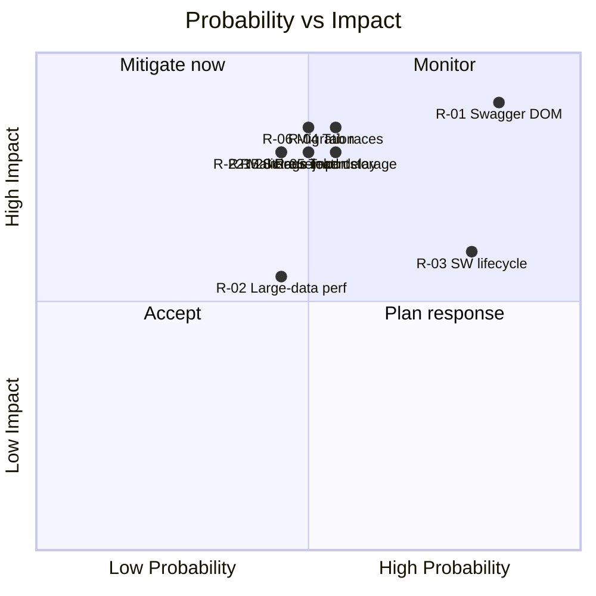

# 17 — Risk Analysis

> Full risk register for v1.0, expanding `01_PROJECT_ANALYSIS.md` §5. Categories: Technical, Architecture, Browser, Performance, Security, Maintenance. Each risk has **Probability**, **Impact**, **Score**, **Mitigation**, and an **Owner/Trigger**. Probability & Impact are Low/Med/High; Score = qualitative severity.

## Scoring key
| | Low (1) | Med (2) | High (3) |
|---|---|---|---|
| **Probability** | unlikely | plausible | expected |
| **Impact** | cosmetic/minor | degraded feature | data loss / product-breaking |

Score = P × I (1–9). **Critical ≥ 6**, High = 4–5, Medium = 2–3, Low = 1.

---

## 1. Technical Risks

| ID | Risk | P | I | Score | Mitigation | Trigger to revisit |
|---|---|---|---|---|---|---|
| R-01 | **Swagger UI DOM coupling** — auth/request read+write depends on Swagger internals that differ across 3.x/4.x/5.x and can break on update | H | H | **9** | Isolate all DOM access in `SwaggerAdapter` behind a versioned interface; version-matrix fixtures (T-10.6); spike first (T-01.11); graceful degradation when DOM not found | Any Swagger release; adapter test failure |
| R-02 | **Large local data** — big histories/payloads (quota largely resolved by `unlimitedStorage`/DD-035; residual risk is *performance & memory*, not storage failure) | M | M | 4 | `unlimitedStorage` removes the ~5–10 MB ceiling; DD-031 performance cap + cache offload + virtualized lists; `STORAGE_QUOTA_WARNING` retained as a safety net (disk-low / perm ungranted) | Perf regression at scale |
| R-12 | **Response capture mechanism** unproven/security-sensitive | L | M | 2 | **Resolved DD-033:** DOM observation only for v1.0 (no network interception); validate across Swagger versions in spike T-06.1; security sign-off | Spike outcome |
| R-13 | **Variable substitution scope** could force request rewriting | L | M | 2 | **Resolved DD-032:** Companion-scoped populate-time substitution; never rewrites outgoing requests; dynamic chaining deferred to Workflow Runner v1.2 | — |

## 2. Architecture Risks

| ID | Risk | P | I | Score | Mitigation | Trigger |
|---|---|---|---|---|---|---|
| R-03 | **MV3 service-worker lifecycle** — aggressive termination; no long-lived memory state | H | M | **6** | Stateless worker; rehydrate from storage on wake; idempotent handlers; no in-memory-only state (architecture §9) | Lost-event reports |
| R-04 | **Multi-tab / multi-window storage races** (EC-002/003) | M | H | **6** | Per-project single-writer lock (T-01.4); debounced/batched writes; last-write reconciliation; race test in CI | Corruption report |
| R-14 | **Module coupling creep** — features importing each other, eroding modularity | M | M | 4 | ESLint import-boundary rules; event-bus-only communication; PR review checklist item | Lint violation |
| R-06 | **Migration corruption** across schema versions (EC-033/034/042) | M | H | **6** | Snapshot-before-migrate; rollback-on-failure; never partial-migrate; migration tests (T-01.6); block newer-schema imports | Migration test failure |

## 3. Browser Risks

| ID | Risk | P | I | Score | Mitigation | Trigger |
|---|---|---|---|---|---|---|
| R-05a | **Cross-browser variance** (Chrome/Edge/Brave/Arc/Opera) in `chrome.*` APIs & injection | M | M | 4 | Cross-browser matrix (T-10.5); feature-detect; avoid Chrome-only APIs | Matrix failure |
| R-15 | **Chrome Web Store review rejection** (permissions/privacy/remote code) | M | H | **6** | Lean permission set (storage/activeTab/scripting/unlimitedStorage/downloads — DD-035) **each justified in the listing**; clear local-first privacy policy; **no remote code**; pre-submit checklist | Store feedback |
| R-16 | **Incognito / restricted storage** (EC-004) | L | M | 2 | Detect restricted storage; degrade to session-only + notify user | — |
| R-17 | **MV2→MV3 ecosystem churn / future Chrome changes** | L | M | 2 | Already on MV3; track Chrome extension changelog | Chrome announcement |

## 4. Performance Risks

| ID | Risk | P | I | Score | Mitigation | Trigger |
|---|---|---|---|---|---|---|
| R-18 | **Large OpenAPI specs (5,000+ endpoints)** slow search/sidebar (EC-039) | M | M | 4 | One-time endpoint index; virtualized lists; debounced search; perf benchmarks (T-10.2) | Bench regression |
| R-19 | **Large response/history payloads** freeze UI (EC-015/023) | M | M | 4 | Lazy-load full records; virtualize; offload to `cache/`; size caps | Bench regression |
| R-20 | **Injection slows Swagger page load** (NFR: no noticeable delay) | M | H | **6** | Defer non-critical init; lazy-load panels; measure page-load delta in E2E | Page-load delta > budget |
| R-21 | **Bundle-size bloat** | M | M | 4 | Bundle budget in CI; tree-shaking; dependency policy; lazy chunks | Size check fail |

## 5. Security Risks

| ID | Risk | P | I | Score | Mitigation | Trigger |
|---|---|---|---|---|---|---|
| R-05 | **Plaintext token storage** exposure | M | H | **6** | DD-037: mask in UI; never log (lint+test); per-project isolation; export warning; optional passphrase Web Crypto encryption as v1.1 fast-follow; **security-reviewer sign-off required** | Security review |
| R-22 | **Malicious import / XSS** (EC-045/046/047) | M | H | **6** | Strict schema validation; sanitize; never render unsafe HTML; never execute imported content; security tests (§13.7) | Security review |
| R-23 | **Cross-project data leakage** (FR-024) | L | H | 3 | Project-scoped keys; isolation fuzz test; review checklist | Isolation test fail |
| R-24 | **Dependency vulnerability** | M | M | 4 | `npm audit` CI gate; dependency policy; minimal deps; Dependabot | Audit finding |

## 6. Maintenance / Project Risks

| ID | Risk | P | I | Score | Mitigation | Trigger |
|---|---|---|---|---|---|---|
| R-25 | **Open-source contributor onboarding friction** | M | M | 4 | This planning suite; CONTRIBUTING; identical module shape; docs-first (DD-027) | Contributor feedback |
| R-26 | **Doc/code drift** | M | M | 4 | DoD requires doc updates; PR checklist; changelog discipline | Review |
| R-27 | **Scope creep into deferred v1.1+ features** | M | M | 4 | MVP scope locked (`16_MVP_SCOPE`); deferred features in backlog only; PO gate | Planning |
| R-28 | **Single-maintainer bus factor / unconfirmed PO answers** | L | M | 2 | The 8 PO questions are **resolved (DD-031…DD-038)**; only DD-033 & DD-037 await security-reviewer sign-off; decisions logged; CODEOWNERS | Phase entry |
| R-29 | **License/asset/branding unresolved** (Analysis §7) | M | L | 2 | License resolved (**DD-036: MIT**); branding/listing assets still needed for Phase 10 (T-11.2) | Release prep |

---

## 7. Risk Heat Map

## 8. Top-Priority Mitigations (do early)
1. **R-01 (+ R-12 validation):** Front-load the Swagger-adapter spike (T-01.11) and the DOM response-capture spike (T-06.1, validating DD-033) in Phase 0–1/S9. (R-13 variable scope is settled by DD-032 — no spike needed.) These de-risk the product's core value.
2. **R-04 / R-06:** Build the storage write-lock and migration rollback **before any feature stores data** (Phase 1, S2).
3. **R-03 / R-20:** Design the worker stateless and measure page-load delta from the first injection.
4. **R-05 / R-22:** Enforce no-token-logging lint rule and import sanitization from the first auth/import code; security review gates every release.
5. **R-15 / R-29:** Provision the Web Store account and resolve license/assets/privacy text early.

## 9. Risk Review Cadence
- Reviewed at every **sprint retro** (new risks, status changes).
- Re-scored at each **phase gate** (Exit Criteria in `02_PHASE_PLAN.md`).
- Critical risks (score ≥ 6) tracked as standing agenda items until mitigated below threshold.
