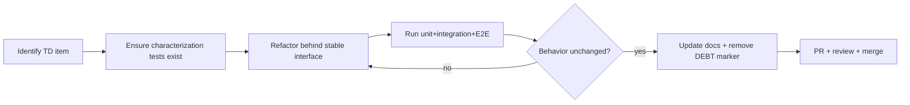

# 18 — Technical Debt Strategy

> How OpenAPI Companion **prevents**, **detects**, **tracks**, and **safely repays** technical debt — given the explicit constraint that *maintainability is more important than speed* and the project will be open source with many contributors. Aligns with `docs/19_DESIGN_DECISIONS.md`, `docs/20_CONTRIBUTING.md`, and the backlog's tech-debt items.

## 1. Principle
> Maintainability > velocity. A feature is not "done" because it works; it is done when it is tested, documented, reviewed, and leaves the codebase as clean as it found it (DD-030). Debt is acceptable only when **conscious, recorded, and scheduled** — never silent.

## 2. Preventing Technical Debt

### Architectural guardrails (compile-/lint-time)
| Guardrail | How enforced |
|---|---|
| `UI → Service → Storage` only; no `UI → Storage` | ESLint import-boundary rules; CI fail on violation |
| Modules never import each other | Import-boundary rules; communication only via EventBus (`12`) |
| Only `SwaggerAdapter` touches Swagger DOM | Lint rule restricting DOM APIs outside `adapters/` |
| Identical module shape (`service/store/types/...`) | Scaffolding template + review checklist |
| Strict TypeScript, no `any` | `tsconfig` strict; `no-explicit-any` lint error |
| No tokens/secrets in logs | Custom lint rule + security test |
| Typed events only | `EventPayload` map (compile-time) |

### Process guardrails
- **Documentation-first** (DD-027): no implementation before the feature's spec is complete; docs updated as part of DoD.
- **Definition of Done** (DD-030): implementation + tests (unit/integration/E2E) + edge cases + docs + review + no lint/type errors + no regressions.
- **Dependency policy** (CONTRIBUTING): before adding a dependency, justify maintenance, problem fit, build-it-ourselves cost, and bundle impact.
- **Small PRs / vertical slices**: tasks in `05_TASK_BREAKDOWN.md` are story-point-sized to keep changes reviewable.
- **Design principles**: DRY, KISS, SOLID, single-responsibility, composition over inheritance (CONTRIBUTING).

### Quality budgets (CI-enforced, see `15_CI_CD.md`)
- Coverage thresholds (`13_TEST_PLAN.md` §3).
- Bundle-size budget (R-21).
- `npm audit` high/critical = fail.
- Performance benchmarks within tolerance (NFR).

## 3. Detecting Technical Debt
| Signal | Source |
|---|---|
| Coverage drop | CI coverage gate |
| Bundle growth | CI size check |
| Lint/type suppressions (`// eslint-disable`, `@ts-ignore`) | Tracked; each requires a `// DEBT(<id>):` comment + backlog item |
| Duplicate logic | Review + periodic `jscpd`/similar scan |
| Slow tests / flaky tests | CI timing + flake tracking |
| Dependency staleness | Dependabot + scheduled audit |
| Adapter fragility | Swagger version-matrix failures (R-01) |

**Debt marker convention:** any deliberate shortcut is annotated `// DEBT(TD-NN): <why> <repay-plan>` and mirrored as a `TD-NN` backlog item, so debt is greppable and never invisible.

## 4. Tracking Technical Debt
- A dedicated **Tech-Debt backlog** category (the project backlog already tracks: refactor duplicated code, improve test coverage, reduce bundle size, optimize storage writes, update dependencies, improve documentation, remove deprecated APIs, improve accessibility).
- Each item: `TD-NN`, description, origin (PR/commit), impact, estimated effort, **interest** (how fast it worsens), proposed repayment sprint.
- Reviewed at **backlog refinement** each sprint; at least a small debt allocation reserved per sprint.

| Field | Example |
|---|---|
| ID | TD-07 |
| Title | Adapter relies on Swagger 4.x DOM selector |
| Origin | PR #142 |
| Impact | Breaks auth restore on Swagger 5.x |
| Interest | High (next Swagger release) |
| Repayment | Sprint 14 hardening (T-10.6) |

## 5. How to Review Architecture
- **Phase-gate architecture review:** at each phase exit (`02_PHASE_PLAN.md`), confirm modularity, dependency rules, and that adding the next module required no edits to existing modules (architecture success criterion).
- **ADR discipline (DD-xxx process):** any architectural change marks the old decision **Deprecated**, creates a new Decision ID with rationale, and updates dependent docs (decision-management process from `docs/19`).
- **Periodic dependency-graph check:** regenerate the module dependency view (`06`/`07`) and assert no new cross-module imports.
- **Review checklist** (every PR, from CONTRIBUTING): correctness, readability, performance, security, test coverage, documentation, architectural consistency.

## 6. How to Refactor Safely

Rules:
1. **Tests first** — never refactor code that lacks characterization tests; add them first.
2. **Behind interfaces** — refactor implementation while keeping the service/adapter interface (`11`) stable, so callers and tests are untouched.
3. **One concern per PR** — separate refactors from feature changes for clean review and revert.
4. **Feature-flag risky migrations** if needed; keep changes reversible (e.g. storage migrations have rollback).
5. **Adapter changes** always run the Swagger version matrix (R-01) before merge.

## 7. Debt That Is Expected (and accepted) for v1.0
Recorded deliberately so it isn't mistaken for oversight:
| Item | Why deferred | Repay when |
|---|---|---|
| Plaintext token storage (no encryption-at-rest) | DD-037: masking + warnings sufficient for MVP; encryption without passphrase adds little real protection | v1.1 optional passphrase encryption |
| Single doc-tool adapter (Swagger only) | MVP scope; adapter seam already abstracts it | v1.4 (ReDoc), v1.x (Scalar/RapiDoc) |
| `chrome.storage.sync` unused | Settings sync is future | When cloud/sync work begins |
| Basic response viewer (no tree/compare) | Response Inspector is v1.3 | v1.3 |
| No File System Access "working folder" mode (Downloads JSON backup instead) | DD-039: extensions can't auto-read files, so a direct-folder live store would break zero-friction restore | Post-v1.0 power-user opt-in |

## 8. Anti-Patterns to Reject in Review
- Business logic in components or in the content script.
- Direct `chrome.storage` access outside `StorageService`.
- Direct Swagger DOM access outside `SwaggerAdapter`.
- Cross-module imports instead of events.
- `any`, unchecked nulls, unnecessary type assertions.
- Logging tokens/secrets.
- Untested edge cases shipped "to be covered later" without a `TD-NN` item.

## 9. Success Criteria
Technical-debt strategy is working when: coverage and bundle budgets hold across releases; new modules slot in without touching existing ones; the DEBT backlog is small and decreasing; and a new contributor can land a correct PR using only `planning/` + `docs/` without asking architecture questions.
