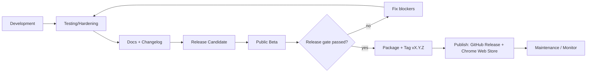

# 19 — Release Plan

> How OpenAPI Companion ships v1.0.0 and beyond: release lifecycle, the v1.0 checklist, Chrome Web Store publication, changelog/release notes, and rollback. Built on `docs/16_MVP_SCOPE.md`, `docs/17_ROADMAP.md`, `docs/21_CHANGELOG.md`, `14_GIT_STRATEGY.md`, and `15_CI_CD.md`.

## 1. Release Lifecycle (every release)
```
Planning → Design → Development → Testing → Documentation → Beta → Release → Maintenance
```
For v1.0 these map to Phases 0–10 (`02_PHASE_PLAN.md`). The release-specific stages (Beta → Release) are Phases 9–10.



## 2. Version 1.0 Scope (locked)
**Included (7 modules):** Authentication Manager, Request Manager, Environment Manager, API History, Fake Data Generator, Productivity Tools, Settings — feature lists per `docs/16_MVP_SCOPE.md`.
**Explicitly deferred:** Collections (v1.1), Workflow Runner (v1.2), Response Comparison/Inspector (v1.3), ReDoc (v1.4), Firefox (v1.5), Team Collaboration (v2.0).
**Known v1.0 limitations (documented in release notes):** Swagger UI only; local storage only; no cloud sync/collaboration/plugins.

## 3. v1.0 Deliverables (from MVP doc)
- Browser Extension (Manifest V3) packaged `.zip`.
- Complete documentation (the `docs/` set + `planning/`).
- Installation Guide + User Guide.
- Public GitHub repository.
- Chrome Web Store package + listing assets.
- Release Notes + finalized Changelog.

## 4. Release Readiness Checklist (gate for tagging v1.0.0)
Combines the MVP release checklist, security pre-release checklist, and DoD.

**Functional**
- [ ] All 7 MVP modules feature-complete; acceptance criteria met.
- [ ] All critical user flows (E2E-01…E2E-15) pass.

**Quality**
- [ ] All documented edge cases (EC-001…048 in scope) handled & tested.
- [ ] Coverage thresholds met; no failing tests.
- [ ] Performance targets met (`13` §6); bundle within budget.
- [ ] Cross-browser verified: Chrome, Edge, Brave, Arc, Opera.
- [ ] Accessibility (WCAG 2.1 AA) audit passed.

**Security (pre-release checklist, `docs/13`)**
- [ ] Permission set is exactly `storage`, `activeTab`, `scripting`, `unlimitedStorage`, `downloads` (DD-035) — each justified in the listing; no others.
- [ ] No sensitive logging; tokens masked; no auto-copy.
- [ ] Input validation; safe import/export; project isolation verified.
- [ ] Migration tested (incl. rollback); no data loss on upgrade.
- [ ] Dependency audit clean (no high/critical).
- [ ] No remote code.

**Storage / Data**
- [ ] Storage migration tested on a populated store.
- [ ] Export→import round-trip verified.

**Docs & Distribution**
- [ ] Documentation complete; changelog updated; release notes written.
- [ ] GitHub repository prepared (templates, SECURITY.md, CODE_OF_CONDUCT.md, **LICENSE: MIT — DD-036**).
- [ ] Chrome Web Store assets ready (icons, screenshots, copy, privacy policy).
- [ ] Rollback plan documented.

## 5. Changelog & Release Notes
- Format: **Keep a Changelog** + SemVer (`docs/21_CHANGELOG.md`).
- Sections per release: Added, Changed, Improved, Fixed, Removed, Deprecated, Security, Known Issues.
- Generated from Conventional Commits (`14_GIT_STRATEGY.md`) then human-edited for **user impact** (not implementation detail).
- v1.0.0 `[Unreleased] → [1.0.0]` promotion lists all 7 modules + security features (local-only, zero telemetry, project isolation, secure token handling) + known issues (Swagger-only, no Firefox, Workflow/Collections deferred).

## 6. Chrome Web Store Publication
1. Provision a Web Store developer account early (verification lead time — R-15).
2. Prepare listing: name (OpenAPI Companion), description, category (Developer Tools), screenshots, promo images, **privacy policy** (local-first, zero telemetry — `docs/13`).
3. Declare permission justifications (`storage`/`unlimitedStorage` = local data persistence; `downloads` = user-initiated/auto JSON backup; `activeTab`/`scripting` = inject the companion UI on the docs page) and the **single purpose**.
4. `release.yml` packages and uploads via the Web Store API behind a manual production approval (`15_CI_CD.md`).
5. Submit for review; respond to any policy feedback (minimal permissions + no remote code reduce rejection risk).

## 7. Rollback & Incident Response (client-side)
There is no server. Strategy:
- **No instant store rollback** — fix-forward by publishing a patched version (e.g. `1.0.1`) via `hotfix/*` (`14_GIT_STRATEGY.md`).
- Keep the previous packaged `.zip` as a GitHub Release artifact for emergency manual install.
- If a release causes data risk, unpublish/disable the listing and communicate via release notes + repo.
- **Storage safety:** migrations are forward-only with rollback, and old schema reads are supported within the migration window, so a user on a newer build downgrading does not corrupt data.
- Crash/issue intake via GitHub issue templates (zero telemetry means we rely on user reports — security/privacy posture preserved).

## 8. Post-Release (Maintenance) & Next Versions
Per roadmap, after a stable v1.0:
| Version | Theme | Trigger to start |
|---|---|---|
| 1.0.x | Patches from beta/field reports | as needed |
| 1.1.0 | Collections | v1.0 stable |
| 1.2.0 | Workflow Runner | post-Collections |
| 1.3.0 | Response Comparison / Inspector | post-Workflow |
| 1.4.0 | ReDoc support (new adapter) | doc-tool expansion |
| 1.5.0 | Firefox support | cross-browser expansion |
| 2.0.0 | Team Collaboration (breaking) | cloud track |

Each follows the same lifecycle, checklist, and DoD. New adapters/modules slot in without v1.0 rework (architecture scalability rule).

## 9. Release Roles
| Role | Responsibility |
|---|---|
| Release Manager | Drives the checklist, cuts `release/*`, tags, publishes |
| QA Lead | Signs off functional + cross-browser + a11y |
| Security Reviewer | Signs off the security checklist |
| Tech Lead | Approves architecture/migration safety |
| PO | Confirms scope + resolves open questions (Analysis §9) |
