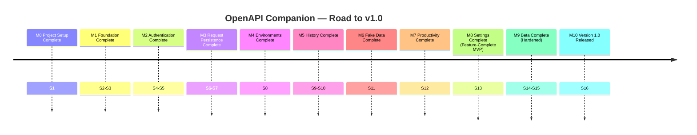
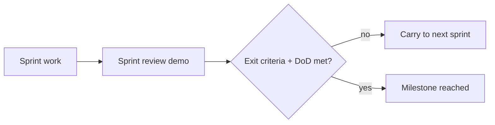
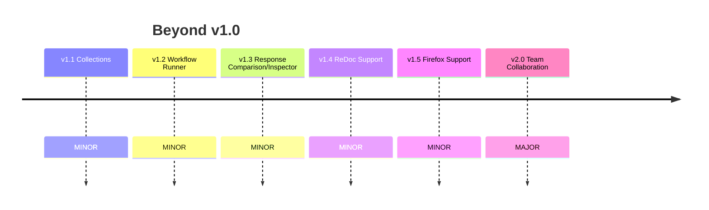

# 20 — Milestones

> The milestone roadmap from empty repo to **Version 1.0 Released**, then the post-v1.0 trajectory. Milestones are the externally visible checkpoints that aggregate phases (`02_PHASE_PLAN.md`), sprints (`03_SPRINT_PLAN.md`), and epics (`04_EPICS.md`).

## 1. v1.0 Milestone Timeline

## 2. Milestone Definitions

| ID | Milestone | Phase | Sprints | "Done" means |
|---|---|---|---|---|
| **M0** | Project Setup Complete | P0 | S1 | Loadable MV3 extension; CI green; new-dev path < 15 min |
| **M1** | Foundation Complete | P1 | S2–S3 | Storage+migration+events+project detection+adapter seam+sidebar shell working; Swagger detected, default env created, Swagger unaffected |
| **M2** | Authentication Complete | P2 | S4–S5 | Auth persists & auto-restores < 100 ms; isolated per project+env; tokens never logged (E2E-03/04) |
| **M3** | Request Persistence Complete | P3 | S6–S7 | Request data survives refresh > 99%; templates CRUD; no auto-execute (E2E-05/06/07) |
| **M4** | Environments Complete | P4 | S8 | One-click switch < 200 ms re-loads auth+requests; variables; no leakage (E2E-08) |
| **M5** | History Complete | P5 | S9–S10 | All executions recorded; replay logs new record; fast search at scale (E2E-10/11) |
| **M6** | Fake Data Complete | P6 | S11 | 21 generators; field < 20 ms / all < 150 ms; manual edits preserved (E2E-09) |
| **M7** | Productivity Complete | P7 | S12 | Search < 50 ms @ 5,000 endpoints; favorites/recents; copy-as cURL/Fetch/Axios (E2E-12) |
| **M8** | Settings Complete — **Feature-Complete MVP** | P8 | S13 | Theme/storage-mgmt/import-export/reset; validated import; instant theme (E2E-13/14) |
| **M9** | Beta Complete — **Hardened** | P9 | S14–S15 | All in-scope edge cases tested; NFRs met; security + a11y sign-off; cross-browser pass; beta blockers resolved |
| **M10** | **Version 1.0 Released** | P10 | S16 | Published to Chrome Web Store; release checklist (`19`) fully ticked; rollback plan in place |

## 3. Milestone Exit Gates
Each milestone inherits its phase's **Exit Criteria** (`02_PHASE_PLAN.md`) plus the **cross-phase DoD** (tests, edge cases, docs, review, no regressions). A milestone is not "reached" on a demo alone — its gate criteria must be objectively met (acceptance criteria + E2E + checklist items).

## 4. Critical-Path Milestones
M1 → M2 → M3 → M4 → M5 sit on the critical path (the feature spine). M6 (Fake Data), M7 (Productivity), and M8 (Settings) are slightly off-path and can be parallelized/compressed if staffing allows (`06_DEPENDENCY_GRAPH.md` §4–5). M9–M10 require all prior milestones.

## 5. Baseline Schedule
16 two-week sprints ≈ **32 weeks ≈ 7.5 months** — within the documented 6–12 month envelope. Front-loaded spikes (Vite/MV3, Swagger adapter, response capture, variable scope) protect the critical path; the off-path milestones provide schedule buffer.

## 6. Post-v1.0 Milestones (Roadmap)

| Milestone | Version | Headline |
|---|---|---|
| Collections GA | 1.1.0 | Curated request groups (FDD-006 already designed) |
| Workflow Runner GA | 1.2.0 | Sequential request execution (FDD-007) |
| Response Inspector GA | 1.3.0 | Tree view + compare (FDD-008) |
| Multi-tool support | 1.4.0 | ReDoc adapter (then Scalar/RapiDoc) |
| Firefox support | 1.5.0 | Second browser engine |
| Team Collaboration | 2.0.0 | Shared collections/workflows (cloud-optional, breaking) |

These reuse v1.0's architecture, services, event bus, and storage with no rework — each new module is folder + registration + events + UI entry (architecture scalability success criterion). Long-horizon vision (VS Code/JetBrains, plugin SDK, enterprise) remains in `docs/18_FUTURE_IDEAS.md`.

## 7. Definition of "Version 1 Released" (M10)
> Backend developers can install OpenAPI Companion from the Chrome Web Store, open Swagger UI, keep their existing workflow, and immediately experience persistent auth, saved requests, environments, history, fake data, and productivity tools — **without changing any backend code** — with zero known critical bugs and all release-checklist items satisfied.

That is the success statement from `docs/16_MVP_SCOPE.md`: *"This is exactly what Swagger was missing."*
