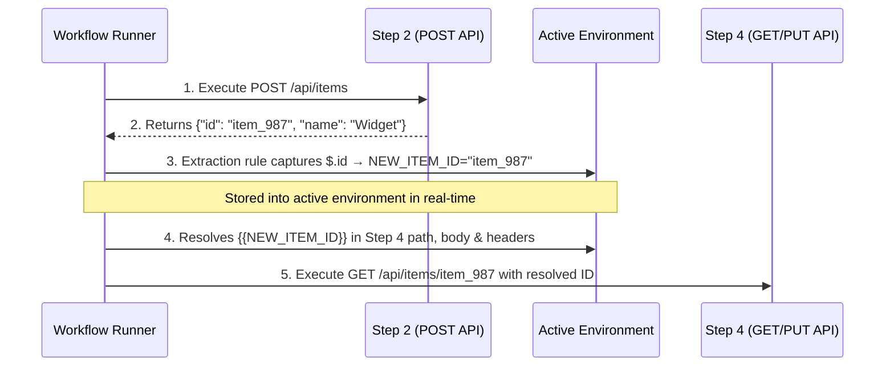

# OpenAPI Companion

> **A browser extension that turns Swagger UI into a persistent, productivity-focused API testing workspace.**

[](https://github.com/pratyanj/OpenAPI_Companion/releases/tag/v1.1.3)
[](./LICENSE)
[](https://chromewebstore.google.com)
[](https://developer.chrome.com/docs/extensions/mv3/intro/)

---

## What is OpenAPI Companion?

OpenAPI Companion is a browser extension that enhances Swagger UI with persistence, productivity, and workflow tools — **without touching your backend**.

Every day backend developers lose time to the same repetitive tasks inside Swagger:

- Re-authenticating after every page refresh
- Copy-pasting JWT tokens for different user roles
- Rebuilding request bodies they already tested
- Re-entering environment URLs manually
- Losing all request history after a server restart

OpenAPI Companion removes all of that. Install it, open your Swagger page, and immediately get a smarter workspace.

---

## Supported Browsers

| Browser | Supported | Notes |
|---|---|---|
| Google Chrome 116+ | ✅ | Native `chrome.sidePanel` |
| Microsoft Edge | ✅ | Native `chrome.sidePanel` |
| Brave | ✅ | Native `chrome.sidePanel` |
| Arc | ✅ | Native `chrome.sidePanel` |
| Opera | ✅ | Native `chrome.sidePanel` |
| Mozilla Firefox (140+) | ✅ | Native `sidebar_action` |

---

## Supported Documentation Tools

| Tool | Supported |
|---|---|
| Swagger UI | ✅ |
| ReDoc | 🔜 Planned |
| Scalar | 🔜 Planned |
| RapiDoc | 🔜 Planned |

---

## Installation

### For Google Chrome, Edge, Brave, Arc, Opera

1. Download **`openapi-companion-1.1.3.zip`** from the [latest release](https://github.com/pratyanj/OpenAPI_Companion/releases/tag/v1.1.3).
2. Unzip the file anywhere on your machine.
3. Open `chrome://extensions` (or `edge://extensions`, `brave://extensions`).
4. Enable **Developer mode** (top-right toggle).
5. Click **Load unpacked** and select the unzipped folder (`manifest.json` is at the root).
6. Pin **OpenAPI Companion** to your toolbar for quick access.

### For Mozilla Firefox

#### Option 1 — Install via Mozilla Add-ons (AMO)
*(Available once published)* — Visit the addons.mozilla.org listing and click **Add to Firefox**.

#### Option 2 — Load Release ZIP in Firefox (Testing / Unpacked)
1. Download **`openapi-companion-1.1.3-firefox.zip`** from the [latest release](https://github.com/pratyanj/OpenAPI_Companion/releases/tag/v1.1.3).
2. Open Firefox and navigate to **`about:debugging#/runtime/this-firefox`** (or menu: *Tools* → *Browser Tools* → *about:debugging*).
3. Click **Load Temporary Add-on…**.
4. Select the downloaded `openapi-companion-1.1.3-firefox.zip` file (or `dist-firefox/manifest.json` if building locally).
5. OpenAPI Companion will appear in your toolbar and extensions list.

#### Option 3 — Build from Source
```bash
npm install
npm run build:firefox
```
* Generates the unzipped Firefox extension in `dist-firefox/`.
* Packages the AMO-ready archive in `share/openapi-companion-1.1.3-firefox.zip`.

---

## Quick Start

1. Open any Swagger UI page (e.g. `http://localhost:8000/docs` or https://petstore.swagger.io).
2. Click the **OpenAPI Companion** toolbar icon — the side panel slides open.
3. Use the tabs to access each feature module.
4. Everything is saved automatically. Refresh the page — your auth and requests are still there.

**Keyboard shortcut:**
* **Chrome / Edge / Brave / Arc:** `Ctrl+Shift+O` / `Cmd+Shift+O`
* **Firefox:** `Ctrl+Alt+O` / `Cmd+Alt+O` (avoids Firefox's built-in bookmark sidebar shortcut)

> [!NOTE]
> **🦊 Firefox Specifics:**
> 1. **No in-page floating launcher button:** Due to Firefox's security model (`sidebarAction.open()` requires a direct user gesture and cannot be triggered from a content-script message), the floating bottom-right icon is hidden on Firefox. Open the sidebar via the toolbar icon, right-click context menu (**"Open OpenAPI Companion"**), or `Ctrl+Alt+O` (`Cmd+Alt+O`).
> 2. **Auto-close when leaving Swagger:** On Firefox, the sidebar automatically closes whenever you switch browser tabs or navigate away from the Swagger documentation page.

---

## Feature Modules

### 🔐 Authentication Manager

The core problem solver. Never re-paste a token again.

**What it does:**
- Saves your authorization token and automatically re-applies it every time the Swagger page loads or refreshes.
- Supports **Bearer Token**, **JWT**, and **API Key** authentication types.
- Stores tokens **per project** and **per environment** so switching contexts never overwrites the wrong credentials.

**Multi-User Token Store:**
- Save named tokens for multiple users (e.g. `Admin`, `Regular User`, `Guest`, `Test Bot`).
- Switch the active token from a single dropdown in the Auth tab — no more copy-pasting.
- Perfect for testing role-based access control (RBAC) without re-logging in constantly.

**How to use:**
1. Open the **Auth** tab in the side panel.
2. Enter your token in the token field and click **Save**.
3. To save multiple users: click **Add account with email and password**, give it a name,email and password. It will automatically add token to your token store
4. To switch users: open the **Saved Tokens** list and click **Use** next to the one you need.
5. Toggle **Auto-restore** to have the extension apply the token automatically on every page load.
6. If token get expire just click **Refresh Token** button in the Auth tab to get new token for that user.

---

### 💾 Request Manager

Never rebuild a request body twice.

**What it does:**
- Automatically saves your request body, query parameters, and path parameters as you type.
- Restores the last-used values when you reopen an endpoint.
- Supports **Request Templates**: save a named snapshot of any request to reuse later.

**Request Templates:**
- **Save**: Fill in a request, click **Save as Template**, give it a name.
- **Apply**: Open the Templates list, click **Apply** — the request fields are filled instantly.
- **Rename / Delete**: Manage templates from the same list.
- Templates persist across browser sessions and server restarts.

**How to use:**
1. Open an endpoint in Swagger UI and fill in the request fields.
2. In the side panel **Requests** tab, click **Save as Template**.
3. Next time, click the template name to restore the full request in one click.

---

### 🌍 Environment Manager

Switch between dev, staging, and production in one click with automated variable extraction.

**What it does:**
- Create named environment profiles (e.g. `Local`, `Staging`, `Production`).
- Each environment stores a **base URL** and custom **variables**.
- Switching environments instantly updates the active context for authentication, requests, and workflows.

**3 Powerful Editor Modes:**
- **Table Mode**: Clean visual key-value editor with a secret masking toggle (hides sensitive tokens, passwords, or API keys).
- **Rules Mode (⚡ Auto-Extraction)**: Automated response-to-variable engine. Define rules matching any endpoint (e.g. `POST /auth/login` or `POST /api/items`) to extract fields from JSON response bodies (supports dot-paths: `id`, `data.token`, `items[0].id`) or response headers and save them directly to your environment.
- **Raw .env Mode**: Full-featured text editor supporting standard `.env` file syntax with real-time validation, syntax highlighting, and auto-save.

**In-Page ⚡ Trigger:**
- Click the lightning bolt icon on any executed response card in Swagger UI to instantly open the rule builder pre-filled with that endpoint.

**Environment Variables:**
Use `{{VARIABLE_NAME}}` syntax anywhere in your requests:
```
{{BASE_URL}}/api/users/{{USER_ID}}
```
Variables resolve automatically before execution across **URL path parameters**, **query parameters**, **headers**, and **request bodies**.

**Import & Export:**
- **Import .env**: Load existing `.env` files directly into your active environment.
- **Export .env**: Export your active environment variables to standard `.env` format.

**How to use:**
1. Open the **Variables** (Environments) tab in the side panel.
2. Click **New Environment**, give it a name (e.g. `Staging`), and set the base URL.
3. Add variables via Table, edit directly in Raw `.env`, or configure automated extraction in the **⚡ Rules** tab.
4. Click the environment name in the header to switch — auth and request context update immediately.

---

### ⚡ Multi-Step Workflow Runner

Automate complex, multi-step API journeys directly within your browser — no external test scripts or Postman collections required.

**What it does:**
- Chains multiple API endpoints into sequential, automated test runs (e.g. *Register → Login → Create Item → Fetch Item → Cleanup*).
- Built-in **Swagger Auto-Population**: One-click fill path params, query params, headers, and body schemas directly from the active Swagger DOM.
- Supports **Execution Failure Modes**:
  - `Stop on failure`: Halts execution immediately if any step fails (perfect for strict integration and regression tests).
  - `Continue on failure`: Executes all steps regardless of errors (ideal for batch operations and cleanup routines).
- **Drag-and-Drop Reordering**: Smoothly rearrange step execution order with intuitive drag handles.
- **Real-Time Runner Modal**:
  - Live visual progress bar and step completion percentage.
  - Streaming per-step execution status (running spinner, success checkmark, error badge).
  - Elapsed duration metrics per step and overall workflow.
  - Expandable response inspection with status codes, duration, and error messages.

#### 🔗 Variable Chaining Between Steps (Passing Step 2 Response to Step 4)

A common requirement is taking dynamic data from an earlier step (such as an ID generated by a `POST` request in Step 2) and passing it into a later step (such as Step 4). OpenAPI Companion handles this seamlessly via **Environment Auto-Extraction Rules** and `{{VARIABLE_NAME}}` placeholders.



**Step-by-Step Walkthrough:**

1. **Create an Extraction Rule for Step 2:**
   - In the sidebar, open the **Variables** tab and click the **⚡ Rules** sub-tab.
   - Click **+ Add Rule** (or click the ⚡ icon on the endpoint in Swagger UI).
   - Set **Endpoint** to Step 2 (e.g. `post /api/items`).
   - Set **Source** to `Response Body`.
   - Set **Property** to the JSON path of the ID:
     - Root fields: `id` or `token`
     - Nested objects: `data.id` or `result.item.id`
     - Array items: `items[0].id`
   - Set **Target Variable** to `NEW_ITEM_ID`.
   - Click **Save Rule**.

2. **Reference the Variable in Step 4:**
   - Open your workflow in the **Workflows** tab and edit **Step 4**.
   - Use `{{NEW_ITEM_ID}}` wherever the ID is required:
     - **In URL Path Parameters**: set parameter `id` to `{{NEW_ITEM_ID}}` (resolves to `/api/items/item_987`).
     - **In Request Body**: `{ "itemId": "{{NEW_ITEM_ID}}", "status": "active" }`.
     - **In Query Parameters**: `?itemId={{NEW_ITEM_ID}}`.
     - **In Headers**: `X-Resource-ID: {{NEW_ITEM_ID}}`.

3. **Run the Workflow:**
   - Click **▶ Run Workflow**.
   - When Step 2 executes, the runner captures the ID and updates your environment in real-time.
   - When Step 4 executes, OpenAPI Companion automatically resolves `{{NEW_ITEM_ID}}` to the generated ID before dispatching the request!

---

#### 📦 Portable JSON Import / Export

Share workflows with teammates or seed them instantly using AI coding assistants in your IDE:

- **Clean & Portable (`version: "1.0"`)**: Exported JSON bundles strip runtime metadata (`id`, `createdAt`, `lastRunAt`, step IDs) so they can be imported anywhere without ID collisions.
- **Smart Conflict Handling**: If a workflow with the same name already exists in storage, the importer automatically renames it with an `(imported)` suffix to prevent accidental overwrites.
- **AI Agent Integration**: Prompt your AI assistant (e.g. Claude, Cursor, Gemini) inside your IDE to generate a workflow bundle and import it with one click:

```json
{
  "version": "1.0",
  "exportedAt": "2026-09-07T10:00:00.000Z",
  "workflows": [
    {
      "name": "User Onboarding & Verification Flow",
      "description": "Create user, login, extract token, and verify profile",
      "mode": "stop-on-failure",
      "steps": [
        {
          "endpointId": "post /auth/register",
          "name": "Register User",
          "body": "{\"email\": \"test@example.com\", \"password\": \"secret123\"}"
        },
        {
          "endpointId": "post /auth/login",
          "name": "Login User",
          "body": "{\"email\": \"test@example.com\", \"password\": \"secret123\"}"
        },
        {
          "endpointId": "get /user/profile",
          "name": "Fetch Profile",
          "headerParams": {
            "Authorization": "Bearer {{TOKEN}}"
          }
        }
      ]
    }
  ]
}
```

---

### 📁 Collections

Organize endpoints into logical groupings for faster navigation and targeted testing.

**What it does:**
- Group endpoints by feature, user journey, microservice, or sprint.
- Add endpoints to collections directly from Swagger UI or the sidebar.
- Filter and search endpoints within a collection.
- Persists per-project so each API documentation page has its own relevant collections.

---

### 📜 API History

Every request you've made, always accessible.

**What it does:**
- Automatically records every API call made through Swagger UI.
- Stores method, endpoint, timestamp, status code, environment, and duration.
- Lets you search, replay,locat API location, and delete history entries.
- store privious history of all the API calls.so we can check the previous requests that we have made and can replay them if needed.
- There is copy feture that let you copy URL, copy uURl,copy PowerShell,copy as Fetch,copy as axios,copy request body,copy responce body.
- Let you see what was request and what was responce data in each entry.

**How to use:**
1. Open the **History** tab in the side panel.
2. Use the search box to filter by endpoint, method, or status code.
3. Click **Replay** on any entry to re-fire that exact request instantly.
4. Click **Delete** to remove individual entries, or **Clear All** to start fresh.

---

### 🎲 Fake Data Generator

Stop typing `test@example.com` and `12345678` by hand.

**What it does:**
- Generates realistic, random test data for filling request bodies.
- Available generators:

| Generator | Example Output |
|---|---|
| Name | `Jordan Mitchell` |
| Email | `j.mitchell@example.com` |
| Phone | `+1-555-0147` |
| UUID | `550e8400-e29b-41d4-a716-446655440000` |
| Password | `Xk9#mP2rQw` |
| Address | `742 Evergreen Terrace, Springfield` |
| Date | `2024-03-15` |
| Boolean | `true` |
| Integer | `4829` |
| Decimal | `72.34` |

**How to use:**
1. Open the **Fake Data** tab in the side panel.
2. Click any generator type to copy a value to your clipboard.
3. Paste it into the relevant Swagger request field.

---

### ⚙️ Settings

**Theme:**
- Click the theme icon (🌙 / ☀️ / 💻) in the side panel header to cycle between **Light**, **Dark**, and **System** modes.

**Import / Export:**
- **Workflows Export / Import**: Export workflows as portable `.json` bundles or import them directly.
- **Environment .env Export / Import**: Export active variables as `.env` or import `.env` files.
- **Full Settings Backup**: Saves all your templates, environments, and settings to a `.json` file.
- **Import**: Loads a previously exported backup file to restore your setup on a new machine.

**Storage Management:**
- View how much `chrome.storage` is in use.
- Clear individual modules or reset everything to defaults.

**Keyboard Shortcuts:**
- `Ctrl+Shift+O` / `Cmd+Shift+O` — Toggle the side panel
- `Ctrl+K` / `Cmd+K` — Open endpoint search palette (from within the panel)

> Shortcut bindings can be changed at `chrome://extensions/shortcuts`.

---

## How Projects Work

OpenAPI Companion automatically identifies each unique OpenAPI project by its origin URL. This means:

- `http://localhost:8000/docs` → one project
- `https://api.staging.example.com/swagger` → separate project
- `https://api.prod.example.com/swagger` → separate project

Each project has **completely independent** auth tokens, request history, templates, and environments. Data never leaks between projects.

---

## Privacy & Security

- 🔒 **100% local** — all data (tokens, requests, history) is stored in `chrome.storage.local` on your machine only.
- 🚫 **No telemetry** — the extension makes no external network requests of its own.
- 🚫 **No account required** — no sign-up, no cloud, no tracking.
- 🚫 **No backend changes** — your API server never knows this extension exists.

---

## Developer Setup

### Prerequisites

- **Node.js ≥ 20** — check with `node -v`
- A Chromium browser: Chrome, Edge, Brave, Arc, or Opera

### 1. Clone and install

```bash
git clone https://github.com/pratyanj/OpenAPI_Companion.git
cd OpenAPI_Companion
npm install
```

### 2. Run tests

```bash
npm test                # run all unit + integration tests once (Vitest)
npm run test:watch      # re-run on file change
npm run test:coverage   # tests + HTML coverage report in coverage/
```

### 3. Quality gates

```bash
npm run typecheck       # TypeScript strict check (tsc --noEmit)
npm run lint            # ESLint (flat config, no `any` allowed)
npm run format:check    # Prettier check  →  npm run format  to auto-fix
```

### 4. Build the extension

```bash
npm run build           # outputs unpacked MV3 extension to dist/
```

### 5. Load in the browser

1. Open `chrome://extensions`.
2. Enable **Developer mode** (top-right toggle).
3. Click **Load unpacked** → select the `dist/` folder.
4. Open a Swagger UI page (e.g. https://petstore.swagger.io) to see the panel mount.

### 6. Live development loop

```bash
npm run dev             # Vite + CRXJS HMR for the injected UI
```

> After changing the background worker or `manifest.config.ts`, click **Reload** on the extension card in `chrome://extensions`.

### 7. End-to-end tests (optional)

```bash
npx playwright install chromium   # one-time ~150 MB download
npm run build                     # E2E runs against the built dist/
npm run test:e2e                  # smoke: extension loads, SW registers, panel boots
```

---

## Project Structure

```
src/
├── background/      MV3 service worker — runs storage migrations on install/update,
│                    manages panel toggle/close via port messaging, handles tab-switch close
├── content/         Headless in-page agent — detects Swagger UI, bridges RPC and state
│                    to the side panel, hosts the ⌘K search palette and launcher button
├── sidepanel/       Native chrome.sidePanel UI (PanelShell + bridge to the agent)
├── sidebar/         Shared panel components: PanelOutlet, tabs, Dashboard
├── adapters/        SwaggerAdapter — the ONLY code allowed to touch the Swagger DOM
├── core/            Foundation: StorageService, EventBus, ProjectMeta, migrations
├── modules/         Feature modules (Auth, Request, Environment, Workflows, Collections, History, Fake Data, …)
├── services/        ThemeManager, ImportExportService, SettingsService
├── hooks/           React hooks: useEventBus, useTheme, …
├── components/      Shared UI components (Tabs, IconButton, ToastLayer, …)
├── types/           Shared TypeScript types and Result<T> utilities
└── tests/           Test setup + in-memory storage fake
```

### Key Architecture Decisions

| Decision | Rationale |
|---|---|
| **Native `chrome.sidePanel`** | Avoids injecting a floating div into the page; uses the browser's own panel chrome |
| **Content script ↔ Side panel RPC** | The panel can't touch the Swagger DOM; the content script acts as an agent, bridging all DOM reads/writes via `chrome.tabs.sendMessage` |
| **`RemoteSwaggerAdapter`** | The panel holds a mirrored snapshot of DOM state; sync reads work locally without round-tripping |
| **`chrome.storage.local`** | 100% local, no cloud dependency, survives browser restarts |
| **Zustand** | Lightweight state management for panel UI, no Redux boilerplate |
| **Manifest V3** | Required for Chrome Web Store; stateless service worker, all durable state lives in storage |

---

## Cutting a Release

> **Rule:** the git tag version MUST match `version` in `package.json`. The CI will fail if they differ.

```bash
# 1. Bump the version — this updates package.json AND creates the commit + tag
npm version patch      # 1.0.0 → 1.0.1  (bug fix)
npm version minor      # 1.0.0 → 1.1.0  (new feature)
npm version major      # 1.0.0 → 2.0.0  (breaking change)

# 2. Push the commit and the tag together
git push origin main --follow-tags
```

The tag push triggers `.github/workflows/release.yml`, which:
1. Runs all quality gates (lint, typecheck, format, unit tests, prod audit)
2. Builds the extension
3. Runs the E2E smoke test against the built `dist/`
4. Publishes a GitHub Release with `openapi-companion-<version>.zip` attached

**To rehearse without publishing:** Go to Actions → *Build · verify · publish* → *Run workflow* (on a branch, not a tag). It uploads the zip as a workflow artifact and creates no release.

---

## Troubleshooting

| Symptom | Fix |
|---|---|
| Panel doesn't appear on a Swagger page | Reload the extension card in `chrome://extensions`, then **hard-refresh the tab** (`Ctrl+Shift+R` / `Cmd+Shift+R`). Reloading the extension doesn't re-inject into already-open tabs. |
| Console: "could not load the search palette" | The tab is running a stale content script (built before your last rebuild). Hard-refresh the tab. |
| Auth token not restored after refresh | Make sure **Auto-restore** is toggled on in the Auth tab. |
| Panel shows "No OpenAPI page connected" | The active tab isn't a Swagger UI page, or it hasn't finished loading. Switch to your Swagger tab and wait for it to fully load. |
| `npm audit` reports vulnerabilities | These are dev-toolchain only (Vite/Vitest/esbuild). The CI gate is `npm audit --omit=dev` → 0 vulnerabilities. Nothing in the shipping bundle is affected. |
| E2E tests can't find the service worker | Run `npm run build` first; Playwright loads the built `dist/`, not the source. |
| CI fails: "Tag vX.Y.Z does not match package.json version" | Bump `package.json` to match the tag, commit, delete the old tag, re-tag the new commit, and push. |

---

## Roadmap

### Current (v1.2)
- ✅ Authentication Manager + multi-user token store
- ✅ Persistent auth across page refreshes
- ✅ Saved requests & request templates
- ✅ Environment profiles with variable support & raw .env editor
- ✅ Zero-click response auto-extraction rules (⚡) & secret masking
- ✅ Multi-Step Workflow Runner with live execution streaming
- ✅ Inter-step data chaining & dynamic variable substitution (`{{VAR}}`)
- ✅ Workflow JSON import / export (AI agent & team sharing)
- ✅ Collections (group related endpoints)
- ✅ API request history with replay
- ✅ Fake data generator
- ✅ Import / Export settings & `.env`
- ✅ Light / Dark / System theme
- ✅ Endpoint search palette (⌘K)
- ✅ Side panel closes on browser tab switch

### Future (Planned)
- 🔜 Response Inspector (pretty JSON, tree view, diff)
- 🔜 ReDoc + Scalar + RapiDoc support
- 🔜 Auto token refresh
- 🔜 Team collaboration & shared collections
- 🔜 Cloud backup (optional)
- 🔜 VS Code extension

---

## Contributing

Contributions are welcome! Please read [`CODE_OF_CONDUCT.md`](./CODE_OF_CONDUCT.md) and [`docs/20_CONTRIBUTING.md`](./docs/20_CONTRIBUTING.md) before opening a PR.

**Quick contribution guide:**
1. Fork the repo and create a feature branch: `git checkout -b feat/my-feature`
2. Write your code. Add tests for any new behavior.
3. Make sure all gates pass: `npm test && npm run typecheck && npm run lint && npm run format:check`
4. Open a PR against `main` with a clear description of the change.

---

## License

[MIT](./LICENSE) — © 2024 Pratyanj

---

## Acknowledgements

Built for backend developers who live inside Swagger UI. Inspired by the philosophy of GitLens for VS Code — a tool that makes an existing tool dramatically better without replacing it.
