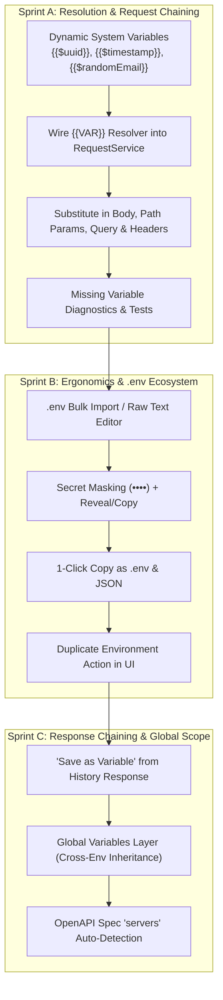

# 3-Sprint Plan: Environment Tab & Variable Ecosystem

This plan outlines the complete roadmap across **3 focused sprints** to transform the **Environment Manager (Env Tab)** into an essential daily productivity hub for API developers.

---

## Sprint Breakdown & Scope

### 🏃 Sprint A: Resolution & Request Populate Chaining (Immediate Win)
**Objective**: Connect environment variables to real API execution so `{{VAR}}` in templates, bodies, and parameters resolve automatically.

1. **Dynamic System Variables Engine**:
   - Extend `substitute()` in [env-service.ts](file:///p:/React%20native/OpenAPI_Companion/src/modules/environment/env-service.ts) to support built-in dynamic generators without requiring manual environment entry:
     - `{{$uuid}}` / `{{$guid}}` → UUIDv4 (`generators.uuid()`)
     - `{{$timestamp}}` → Unix timestamp in seconds
     - `{{$isoDate}}` → ISO 8601 UTC timestamp string
     - `{{$randomInt}}` / `{{$randomInt:min:max}}` → Random integer
     - `{{$randomEmail}}`, `{{$randomName}}`, `{{$randomPhone}}`, `{{$randomBoolean}}`, `{{$randomUrl}}` backed by [generators.ts](file:///p:/React%20native/OpenAPI_Companion/src/modules/fake-data/generators.ts).
2. **Wire Substitution into RequestService (DD-032)**:
   - Connect variable resolution to:
     - `applyTemplate(templateId)`: Resolves body & parameters with the active environment's variables before running `adapter.replay()`.
     - `locateAndFill(templateId)`: Resolves body & parameters before writing into Swagger.
     - `restore(environmentId, endpointId)` / `autoRestoreOpen(environmentId)`.
3. **Comprehensive Missing Variable Reporting**:
   - `resolve()` returns resolved payload + list of missing `{{VARIABLES}}`.
   - Clear diagnostic logs/toasts when unconfigured variables are detected.

---

### 🏃 Sprint B: Developer Ergonomics & .env Ecosystem
**Objective**: Eliminate repetitive manual key-value typing and protect sensitive credentials during daily dev work.

1. **Bulk `.env` Import / Raw Text Mode**:
   - Toggle between **Table View** (key/value rows) and **Raw .env Editor** in [EnvironmentsPanel.tsx](file:///p:/React%20native/OpenAPI_Companion/src/modules/environment/EnvironmentsPanel.tsx).
   - Robust parser supporting `KEY=VALUE`, quoted values (`KEY="val"`), comments (`# ...`), multiline pastes, and JSON objects (`{"KEY": "VALUE"}`).
   - Quick export: *"Copy as .env"* and *"Copy as JSON"*.
2. **Secret Masking & Quick Copy**:
   - Auto-detect or toggle sensitive keys (e.g. `*TOKEN*`, `*KEY*`, `*SECRET*`, `*PASSWORD*`, `*AUTH*`).
   - Mask with `••••••••`, with an eye toggle (`Reveal / Hide`) and an icon-only `CopyButton` (reusing the component pattern from the Auth tab).
3. **Duplicate Environment UI Action**:
   - Add a duplicate icon button in the environment list item to easily clone existing environments (e.g., `Staging (copy)`).

---

### 🏃 Sprint C: Response-to-Variable Chaining, Global Scope & Spec Servers
**Objective**: Complete the feedback loop between API responses, environments, and OpenAPI specs.

1. **"Save as Environment Variable" from History**:
   - In [HistoryDetail.tsx](file:///p:/React%20native/OpenAPI_Companion/src/modules/history/HistoryDetail.tsx), add a 1-click action next to JSON response fields or text selections: *"Save to Active Environment as {{VAR_NAME}}"*.
   - Automatically updates active environment storage and triggers `ENVIRONMENT_CHANGED`.
2. **Global (Shared) Variables Layer**:
   - Introduce a `Global` scope for variables shared across all environments (e.g. `API_VERSION`, `CLIENT_ID`, `TENANT_ID`).
   - Precedence order: `Environment Variable` > `Global Variable` > `Dynamic System Variable`.
3. **OpenAPI Spec `servers` Auto-Detection**:
   - Detect OAS3 `servers` / OAS2 `host` definitions from [SwaggerUiAdapter](file:///p:/React%20native/OpenAPI_Companion/src/adapters/swagger/swagger-ui-adapter.ts).
   - Offer 1-click suggestion pills: *"Import 'https://staging.api.com' as Staging Base URL"*.

---

## User Review Required

> [!IMPORTANT]
> **Populate-Time Substitution Guarantee (DD-032)**:
> In line with security decision DD-032, substitution occurs at **populate/apply-time inside Companion** before dispatching to the Swagger DOM. The extension never intercepts or rewrites browser network requests in-flight, maintaining 100% safety and predictability.

> [!TIP]
> **Dynamic Variable Syntax**:
> Following industry conventions (Postman/Bruno/Insomnia), dynamic system variables use the `$` prefix (e.g. `{{$uuid}}`, `{{$timestamp}}`, `{{$randomEmail}}`).

---

## Detailed Sprint A Implementation Plan

### Proposed File Changes

#### [MODIFY] [env-service.ts](file:///p:/React%20native/OpenAPI_Companion/src/modules/environment/env-service.ts)
- Update `substitute(text, variables)` to evaluate dynamic system variables prefixed with `$`.
- Integrate generators from `src/modules/fake-data/generators.ts`.
- Expand `resolve(text, id)` to resolve against environment variables + dynamic variables.

#### [MODIFY] [env-service.test.ts](file:///p:/React%20native/OpenAPI_Companion/src/modules/environment/env-service.test.ts)
- Unit tests for dynamic variables (`{{$uuid}}`, `{{$timestamp}}`, `{{$isoDate}}`, `{{$randomEmail}}`, `{{$randomInt}}`, etc.).
- Unit tests verifying user-defined environment variables take precedence over dynamic system variables.
- Unit tests for missing variable reporting.

#### [MODIFY] [request-service.ts](file:///p:/React%20native/OpenAPI_Companion/src/modules/request/request-service.ts)
- Add optional variable resolver hook to `RequestServiceOptions` (e.g. `resolveVariables?: (text: string, envId: string) => Promise<Result<{ text: string; missing: string[] }>>` or direct `resolveSnapshot`).
- Apply substitution in `applyTemplate`, `locateAndFill`, and `restore` for `body`, `path`, `query`, and `headers`.
- Maintain debounced autosave behavior without clobbering unresolved templates.

#### [MODIFY] [request-service.test.ts](file:///p:/React%20native/OpenAPI_Companion/src/modules/request/request-service.test.ts)
- Unit tests verifying `applyTemplate` and `locateAndFill` apply resolved variable values.

#### [MODIFY] [src/content/index.tsx](file:///p:/React%20native/OpenAPI_Companion/src/content/index.tsx)
- Wire `environments.resolve` into `RequestService` instantiation.

---

## Verification Plan

### Automated Tests
- Run `npm test` across all updated modules:
  - `src/modules/environment/env-service.test.ts`
  - `src/modules/request/request-service.test.ts`
  - `src/modules/environment/EnvironmentsPanel.test.tsx`

### Manual Verification
1. Open the Side Panel on a Swagger/OpenAPI page (or mock harness).
2. Go to **Env Tab** -> define variable `USER_ID = usr_999`.
3. Go to **Requests Tab** -> create or open a template with body `{"id": "{{USER_ID}}", "trace": "{{$uuid}}", "time": "{{$timestamp}}"}`.
4. Click **Locate & Fill** / **Apply Template** -> verify the Swagger request body receives `{"id": "usr_999", "trace": "<generated-uuid>", "time": "<current-timestamp>"}`.
